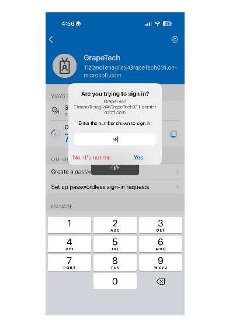
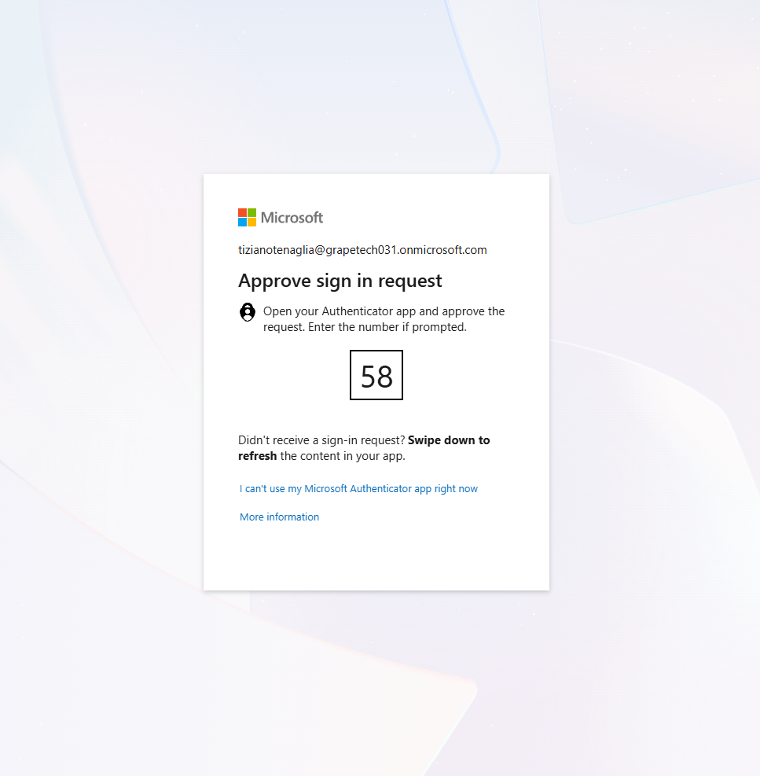
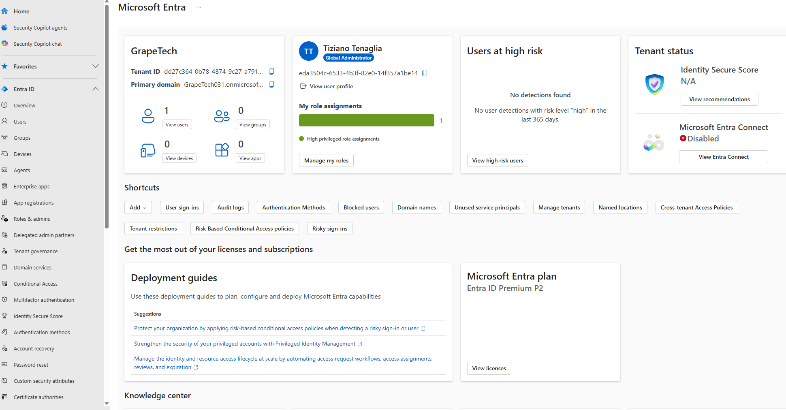

First login into Microsoft Entra

## What I did

Completed my first authenticated sign-in to the GrapeTech Entra tenant using number matching MFA 
via Microsoft Authenticator, then landed on the Entra admin center Overview page as the tenant's 
Global Administrator.

## Sign-in flow

The Microsoft sign-in portal generated a two-digit code (58) that had to be entered into the 
Microsoft Authenticator app on my paired smartphone to approve the request, confirming the login 
was initiated by the legitimate account owner (tizianotenaglia@grapetech031.onmicrosoft.com).

*Desktop sign-in prompt showing the number matching code to approve.*

*Microsoft Authenticator app on my phone, where the same code is entered to confirm the request.*

## Entra admin center overview

After signing in, the Microsoft Entra Overview page confirms my account holds the **Global 
Administrator** role for the GrapeTech tenant — the highest-privilege role in Entra ID, granting 
full access to manage users, groups, roles, policies, licenses, and all other tenant settings. 
This is the role used throughout the lab to configure Conditional Access, PIM, Identity Protection, 
and the other SC-300 scenarios.

*Entra Overview dashboard confirming Global Administrator role assignment for tizianotenaglia@grapetech031.onmicrosoft.com.*