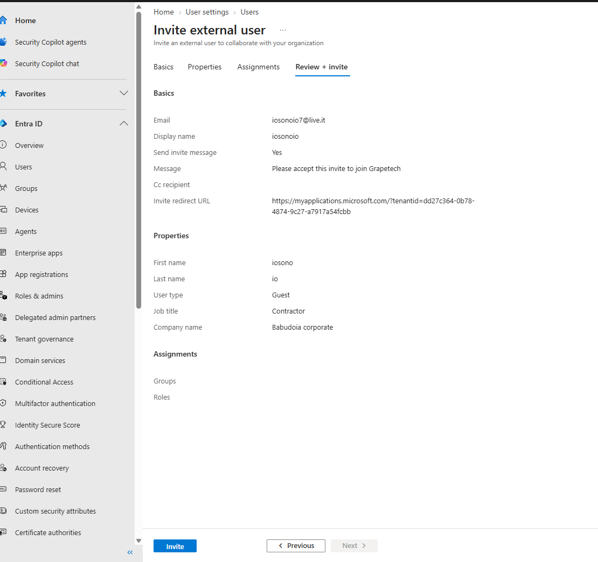
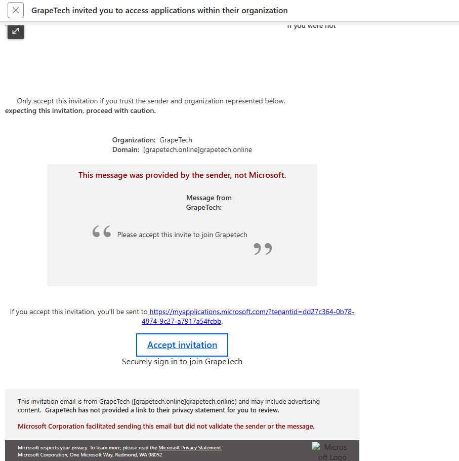

# Why the guest invite

Beyond the internal Member users created via Bulk create, testing the B2B guest invitation flow was 
important to cover a scenario: managing external identities. Real organizations 
routinely need to grant limited access to people who don't work for them directly — contractors, 
partners, vendors, auditors — without creating full internal accounts, passwords, or licenses for them.

Inviting a guest (iosonoio, Contractor at Babudoia corporate) let me demonstrate that external users 
authenticate with their own existing identity rather than tenant-issued credentials, and that Entra 
automatically distinguishes them as User type: Guest, Creation type: Invitation — separate from 
Members in every list, policy target, and access review. This distinction matters for later modules: 
Conditional Access policies, access reviews, and entitlement management often need different rules 
for guests than for employees, and this test confirmed that the guest object model behaves exactly as 
expected before building those policies on top of it.

*Review + invite screen showing all the details entered for the invitation: email, display name, custom message, first/last name, job title, and company name.*

*The actual B2B invitation email received by the guest, showing the organization (GrapeTech), the custom message, and the "Accept invitation" button used to complete the sign-up.*

*All users view showing the new guest "iosonoio" (17 users total), with User type: Guest, Company name: Babudoia corporate, and Creation type: Invitation.*