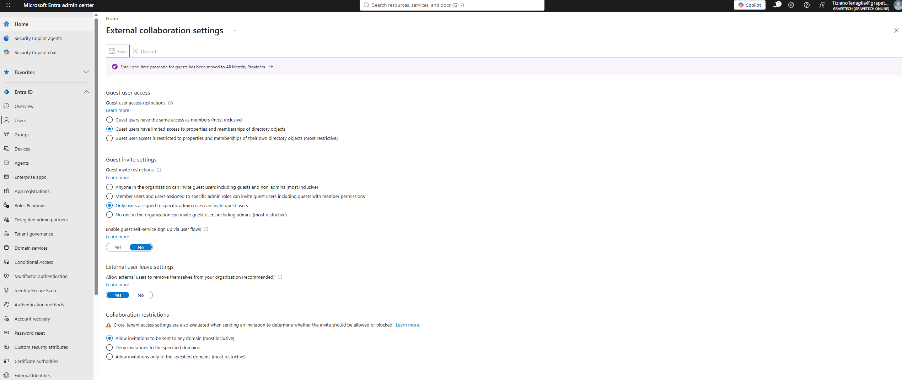

## External collaboration settings (Guest access & invitations)

Configured under Entra ID → External Identities → External collaboration settings — these settings 
govern how B2B guest collaboration works across the whole tenant, separate from the per-guest 
directory visibility setting covered in the previous module.
NBç all these settings apply to the tenant they and it is not possible to apply to single guests.
To apply granular control we need to use Conditional Access  policies or entitled managhement.

### Guest user access → Limited access to properties and memberships (default)
Chose the default middle option instead of the most restrictive one: guests can see basic profile 
info and non-hidden group memberships, but cannot enumerate the full directory. 
This balances collaboration usability (a guest can still see who's in a 
shared group) against exposure of the full internal directory structure.

### What users can invite guests → Only users assigned to specific admin roles
Restricts invitation rights exclusively to users holding admin roles like User Administrator or 
Guest Inviter — regular employees cannot send B2B invitations on their own. This gives tighter 
control over who enters the tenant as an external identity, at the cost of requiring an admin (or 
someone with the Guest Inviter role) to be involved in every invite.

### Guest self-service sign-up via user flows → No
Not building any custom application with a self-service sign-up flow for this project, so this 
feature is disabled — it only matters for developer-built apps that let external users register 
themselves as guests.

### External users can leave without admin consent → Yes
Guests can remove themselves from the organization without needing to contact an admin. For a lab/ 
low-risk environment this reduces friction — in a stricter enterprise setting this might be set to 
No so departures are tracked and reviewed, but for this project's scope, self-service leave is fine 
and reduces unnecessary admin overhead.

### Collaboration restrictions → Allow invitations to be sent to any domain (default)
Left this at the default (no domain allow/deny list configured), meaning invitations can be sent to 
any external domain. In a production environment, this is often locked down to an allow-list of 
trusted partner domains to prevent inviting guests from arbitrary/untrusted organizations — noting 
this as a best practice to apply in a real deployment, even though it wasn't restricted for this lab.

*External collaboration settings page in Entra admin center, showing the final configuration: 
Limited guest access, invite restricted to admin roles only, self-service sign-up disabled, external 
users can leave without consent, and collaboration restrictions allowing any domain.*
