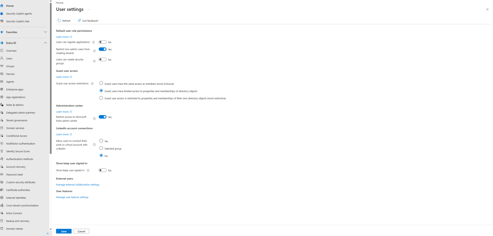

## Baseline security settings – User & Guest configuration

Before moving on to other topics, I locked down a set of baseline 
settings that are commonly left too permissive by default in a new Entra tenant.

### User settings

**Users can register applications → No**
By default, any user can register a new App Registration in the tenant. Disabling this prevents 
regular users from creating potentially insecure or unmanaged app integrations.

**Restrict non-admin users from creating tenants → Yes**
Without this restriction, any user could spin up a brand new, completely separate Entra tenant from 
their account. No reason for a simple user to create a new tenant.

**Users can create security groups → No**
Letting any user create security groups leads to sprawl and makes access harder to audit — groups 
end up used for Conditional Access targeting, app assignments, and permissions, so their creation 
should be controlled by admins to keep the access model clean and reviewable.

### Guest user access restrictions

Three levels are available:
- **Same access as members (most inclusive)** — guests can browse the full directory, same as an internal employee. Too permissive for external collaborators.
- **Limited access (default)** — guests can see their own profile plus basic properties of other users/groups.
- **Restricted access (most restrictive)** — guests can only see their own profile information, nothing else in the directory.

I chose **Restricted access**, since guests in this project are external contractors/partners (like 
the B2B test invite) who should have zero visibility into the internal directory structure beyond 
what they're explicitly granted access to.

### Restrict access to Microsoft Entra admin center → Yes
By default, any licensed user can browse into the Entra admin center UI (even without permissions to 
change anything, they can still view configuration, which is unnecessary exposure). Restricting this 
to admins only reduces the attack surface and keeps the admin portal exclusively for authorized roles.

### LinkedIn account connections → No one
Prevents users from linking their work account to a personal LinkedIn profile. This avoids 
inadvertently exposing organizational identity data (name, job title, company) to a third-party 
consumer platform, which is a data-leakage risk.

### Persistent sign-in ("stay signed in") → Disabled
Users are not allowed to remain signed in after closing the browser. This reduces the risk of session 
hijacking or unauthorized access on shared or unattended devices — every browser restart requires a 
fresh sign-in rather than silently resuming a cached session.

*User settings page in Entra admin center showing the final baseline configuration: app registration 
disabled, non-admin tenant creation restricted, security group creation disabled, guest access set to 
limited, admin center access restricted, LinkedIn connections disabled, and stay-signed-in disabled.*
