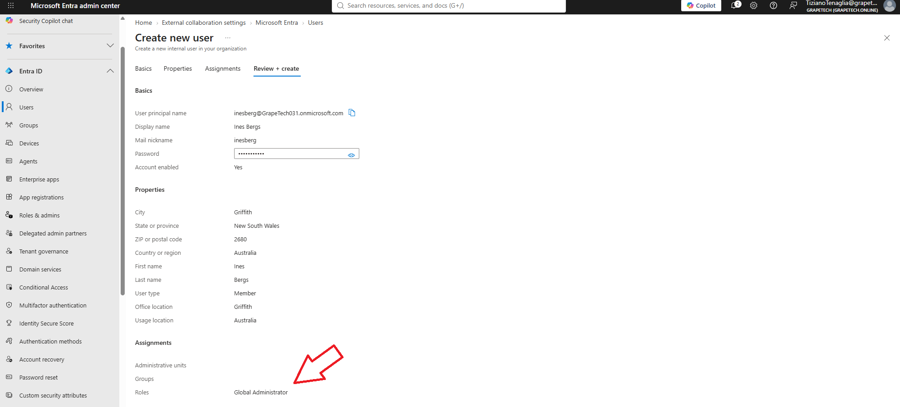

# Break glass accounts

## What I did

Created the first of two emergency access ("break glass") accounts in the GrapeTech tenant, following 
Microsoft's official guidance for emergency access account management.

## Why two accounts, not one

## Screenshot

*First emergency access account created as a cloud-only Member on the .onmicrosoft.com domain, with Global Administrator role assigned at creation.*

A single break glass account is still a single point of failure: if its password were lost, its MFA 
method became unavailable, or the account itself were accidentally disabled during the very emergency 
it's meant to resolve, the organization would remain locked out regardless. Having two independent 
accounts — ideally using two different authentication methods — protects against this scenario.

## Configuration rules followed

- **Cloud-only account, .onmicrosoft.com domain**: created on GrapeTech031.onmicrosoft.com instead of 
  the custom domain, so the account has no dependency on custom domain DNS/verification status.
- **Global Administrator role, permanent (not eligible)**: assigned directly and permanently rather 
  than through PIM eligibility, since an emergency account must not require an activation step that 
  could itself fail during an outage.
- **Authentication method different from other admins**: uses a distinct method (FIDO2 security key or 
  certificate-based authentication recommended by Microsoft) rather than the same method used by 
  day-to-day admin accounts, so that a single point of authentication failure can't lock out both the 
  normal and emergency paths at once.
- **Excluded from Conditional Access policies**: not subject to any Conditional Access policy that 
  could block or restrict sign-in — an enforced policy could otherwise prevent access during the exact 
  emergency the account exists for.
- **Regular activity monitoring**: sign-ins are reviewed at least weekly to confirm the account is only 
  ever used for legitimate testing or genuine emergencies, and to detect any unauthorized use quickly.
- **Secure credential storage**: Microsoft recommends storing credentials in a secure, fireproof, 
  on-site safe (or equivalent secure method) rather than in any single individual's possession, so 
  multiple authorized administrators can access them if needed.