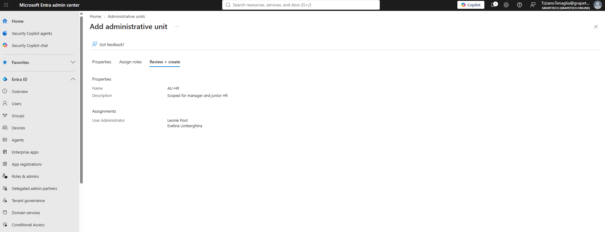
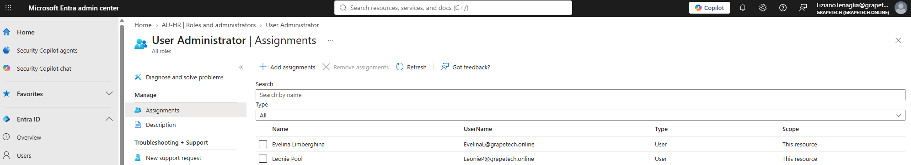
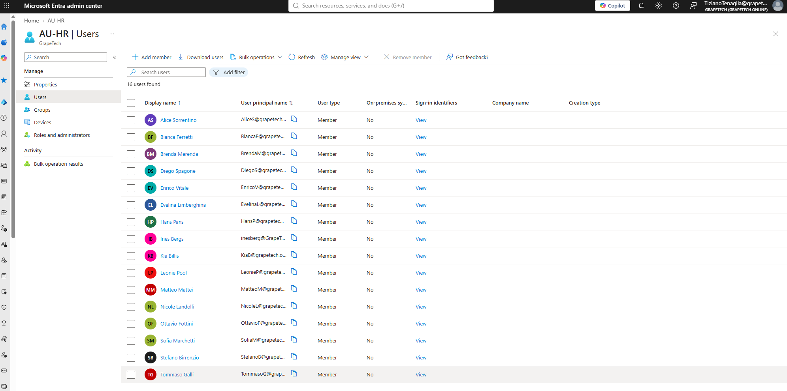

Administrative Units (AU) for scoped delegation

## What is an Administrative Unit

An Administrative Unit (AU) is a container object in Microsoft Entra ID that can hold users, groups, 
or devices. Its purpose is to restrict the scope of an admin role to only the resources inside that 
container, instead of the entire tenant. Without an AU, assigning a role like User Administrator gives 
that person control over every user in the organization; with an AU, the same role can be scoped down 
to just a defined subset.

## Example: GrapeTech as a branch office of a larger company

Imagine GrapeTech isn't a standalone company, but actually a regional branch office of a larger 
parent organization, with its own local HR team. In that scenario, you wouldn't want the branch HR 
staff to have administrative control over employees across the entire global tenant — only over the 
people who work at their own branch.

This is exactly what I set up:

- Created an Administrative Unit named **AU-HR**, containing the branch's users as direct members.
- Assigned Evelina Limberghina and Leonie Pool the **User Administrator** role, scoped only to AU-HR 
  — instead of assigning them User Administrator tenant-wide.
- As a result, Evelina and Leonie can manage (reset passwords, update profile info, block sign-in) 
  only the users who are members of AU-HR — they have no administrative rights over users outside 
  of it, even though they're Global Admin-level "User Administrators" within their scope.

This models a realistic delegation pattern: local HR/IT staff get real administrative power, but only 
over their own office/division, not the whole company.

## A note on groups inside an Administrative Unit

Adding a group to an AU brings the group itself into scope, but membership in that 
group does not automatically extend the AU's management scope down to each member's personal 
account settings. That's exactly why, in AU-HR, I added Evelina and Leonie's *users* directly to the 
AU rather than relying only on the SG-HR group.

*Creating AU-HR, with the User Administrator role assigned directly to Evelina Limberghina and Leonie Pool as part of the creation flow.*

*User Administrator role assignments page for AU-HR, showing Evelina Limberghina and Leonie Pool with Scope: "This resource" — confirming the role only applies within this Administrative Unit, not tenant-wide.*

*Full list of users who are members of AU-HR — these are the only accounts Evelina and Leonie can administer under their scoped User Administrator role.*
