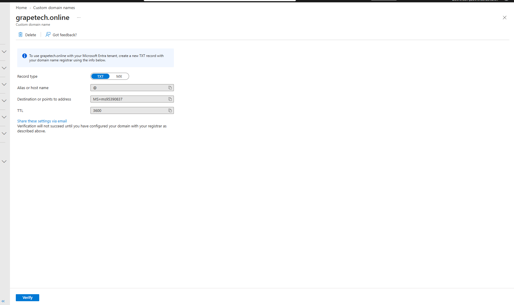
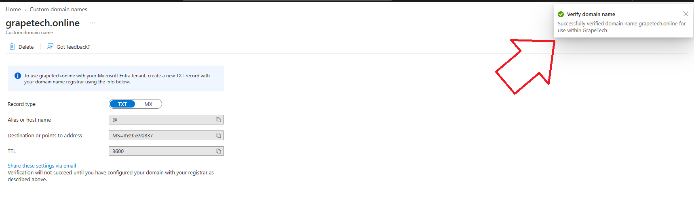
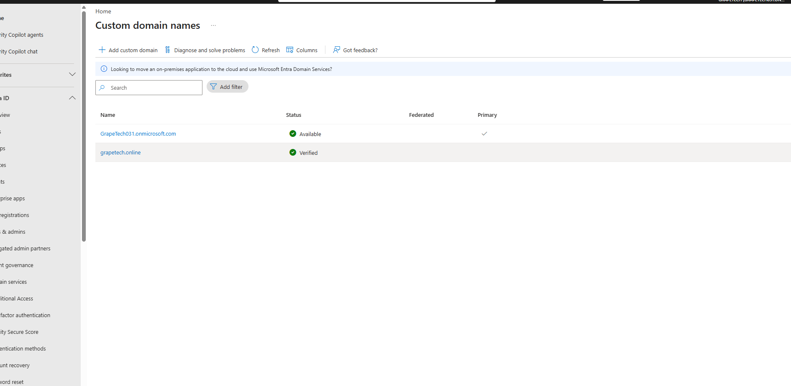
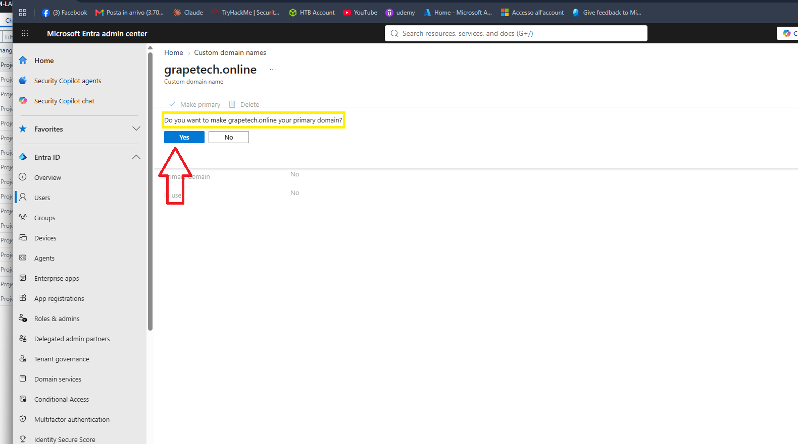

# Module 1.0 – Custom domain registration & verification

## What I did

Registered the domain grapetech.online through Namecheap and added it as a custom domain name in Microsoft Entra ID, 
replacing the default .onmicrosoft.com domain for the GrapeTech tenant. 

## Steps

1. I Purchased grapetech.online via Namecheap.
2. In Microsoft Entra admin center → Identity → Settings → Domain names, added grapetech.online 
   as a custom domain.
3. Entra generated a TXT record to prove domain ownership:
   - Host: `@`
   - Value: `MS=ms95390837`
4. Added this TXT record in Namecheap's Advanced DNS settings (Host Records section).
5. Returned to Entra admin center and clicked **Verify** — after DNS propagation, the domain was 
   successfully verified.

## Why this matters

A verified custom domain allows creating tenant users with a professional identity 
(e.g. `user@grapetech.online`) instead of the default `.onmicrosoft.com` suffix.

## Screenshots

*Custom domain grapetech.online added to the Entra tenant, showing the required TXT record.*

*TXT record created in Namecheap's Advanced DNS panel matching Entra's requirements.*

*Confirmation notification: domain verification succeeded.*

## Setting the custom domain as primary

By default, GrapeTech031.onmicrosoft.com remains the tenant's primary domain even after 
grapetech.online is verified — Entra doesn't switch automatically. The primary domain determines 
which suffix is suggested by default when creating new users going forward.

### Steps

1. Went to Entra admin center → Identity → Settings → Domain names.
2. Confirmed grapetech.online had status **Verified**, while GrapeTech031.onmicrosoft.com was still 
   marked as **Primary**.
3. Clicked on grapetech.online, then selected **Make primary**.
4. Confirmed the action in the prompt ("Do you want to make grapetech.online your primary domain?" → Yes).

Note: setting a domain as primary only affects the suffix suggested for new users. It does **not** 
automatically change the User Principal Name (UPN) of existing accounts — those must be updated manually.

*Custom domain names list: grapetech.online shows as Verified, GrapeTech031.onmicrosoft.com is still Primary.*

*Confirmation prompt after selecting "Make primary" for grapetech.online.*

## Updating the admin account's UPN to the new domain

Since the primary domain switch doesn't retroactively update existing users, I manually changed my 
own admin account's UPN suffix from the default onmicrosoft.com domain to the new custom domain.

### Steps

1. Went to Entra ID → Users → selected my account (Tiziano Tenaglia).
2. Under **Identity**, located the **User principal name** field, which showed 
   `TizianoTenaglia@GrapeTech031.onmicrosoft.com`.
3. Used the domain suffix dropdown next to the username field and selected **grapetech.online** 
   instead of GrapeTech031.onmicrosoft.com.
4. Saved the change — my sign-in identity is now `TizianoTenaglia@grapetech.online`.

*Editing the admin account's UPN, switching the domain suffix from onmicrosoft.com to grapetech.online.*