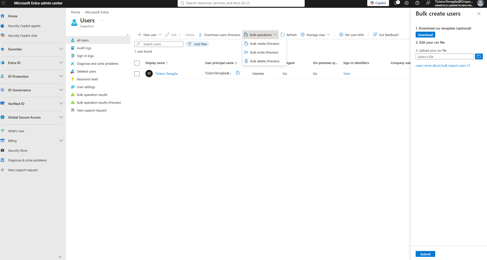
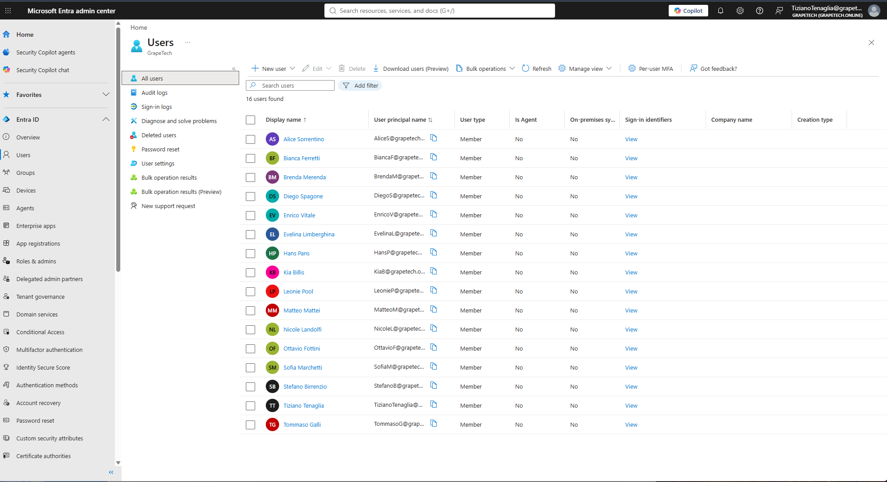

# Module 1.1 – Domain population via Bulk create

## What I did

Populated the GrapeTech tenant with 15 internal member users via the Bulk create feature in 
Microsoft Entra ID, using a CSV file structured across multiple departments (HR, Operations, IT, 
Finance, Sales, and generic staff) to simulate a realistic small organization for testing 
Conditional Access, PIM, and Access Review scenarios later in the project.

## Steps

1. In Entra admin center → Users → All users, opened **Bulk operations** → **Bulk create (Preview)**.
2. Downloaded the official CSV template directly from the portal to ensure the correct column 
   headers and format.
3. Filled in the template with 15 users, each assigned a display name, UPN on the custom domain 
   (@grapetech.online), an initial password, account enabled status, job title, department, and 
   usage location (AU, consistent across all users since it only affects license eligibility, not 
   Conditional Access location logic).
4. Uploaded the completed CSV file and submitted the bulk create job.
5. Verified the result in **All users**: 16 users now listed (15 newly created + my own admin account).

## Screenshots

*Bulk create users panel in Entra admin center, showing the 3-step process: download template, edit CSV, upload file.*

*Final CSV file with 15 users across HR, Operations, IT, Finance, Sales and generic Employee roles. 
Passwords shown as REDACTED here for security — the real file used a shared initial password that 
each user is required to change on first sign-in.*

*All users view in Entra confirming successful creation: 16 users found, matching the 15 new accounts plus the original admin account.*