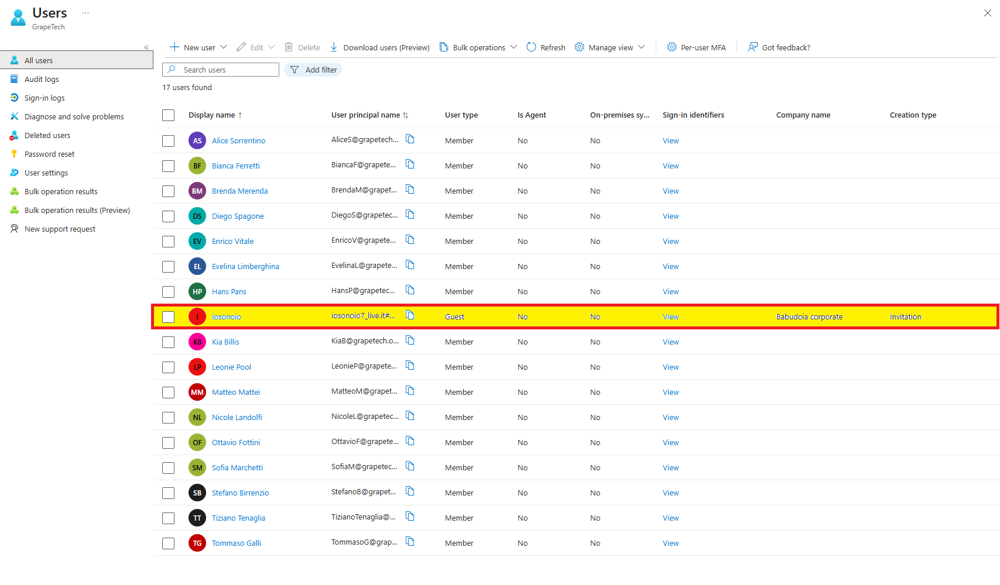

## Screenshots

*Review + invite screen showing all the details entered for the invitation: email, display name, custom message, first/last name, job title, and company name.*

*The actual B2B invitation email received by the guest, showing the organization (GrapeTech), the custom message, and the "Accept invitation" button used to complete the sign-up.*

*All users view showing the new guest "iosonoio" (17 users total), with User type: Guest, Company name: Babudoia corporate, and Creation type: Invitation.*