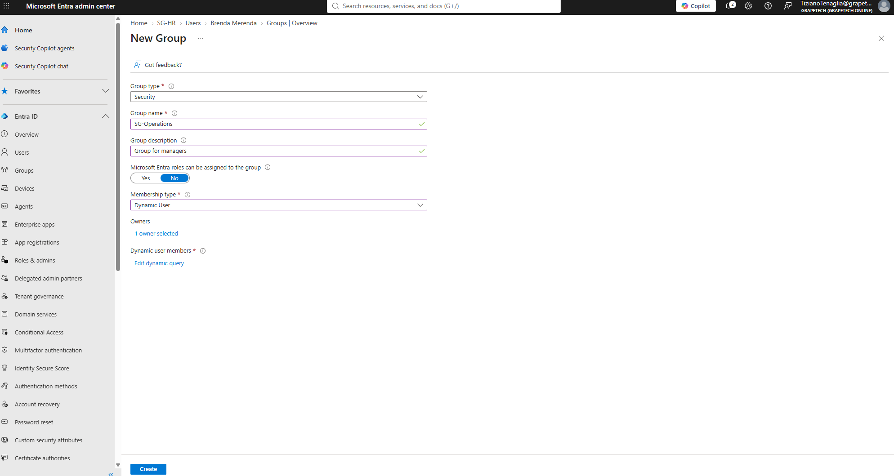
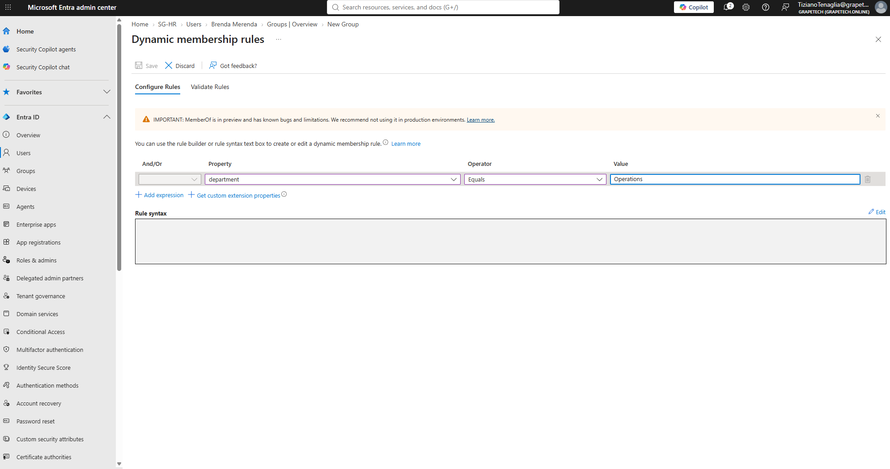
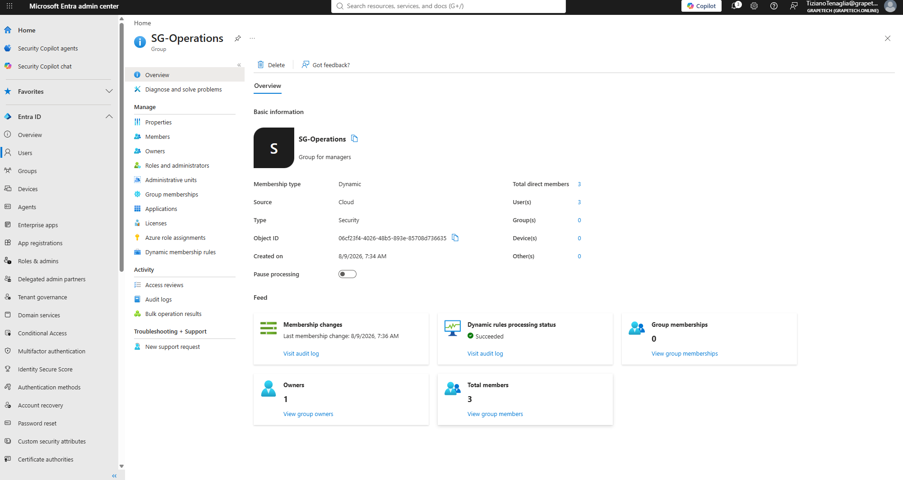
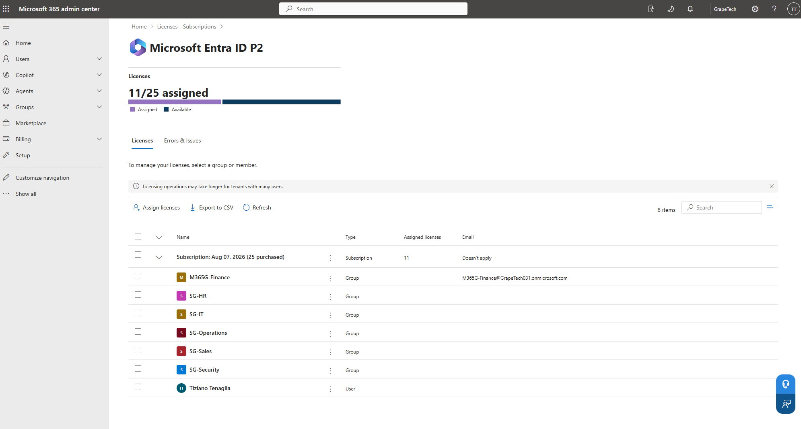
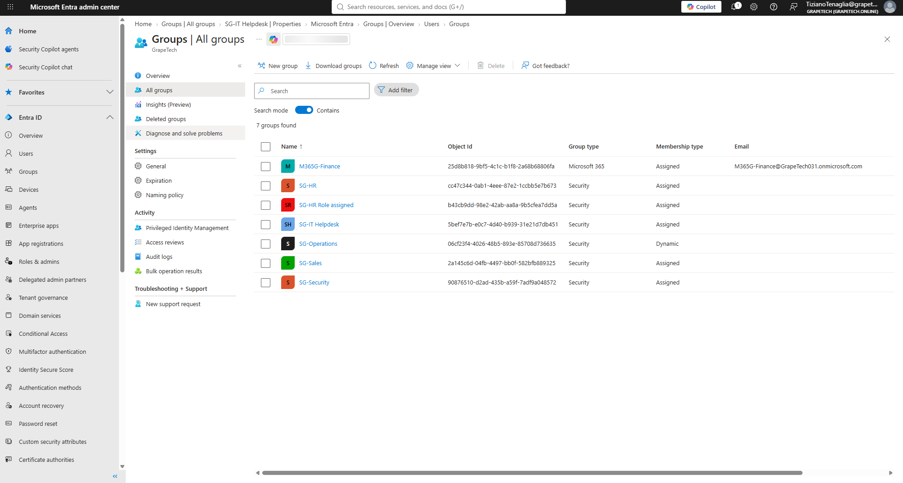

# Module 1.3 – Groups, dynamic membership, and license assignment

## What I did

Built out the GrapeTech tenant's group structure to organize the 15 member users and 1 guest 
created earlier, then used group-based licensing to distribute the tenant's Microsoft Entra ID P2 
licenses instead of assigning them one user at a time. This module covers Microsoft 365 vs. Security 
groups, static vs. dynamic membership, writing a dynamic membership query, role-assignable groups, 
and group-based license assignment.

## Microsoft 365 groups vs. Security groups

Entra ID supports two manageable group types, and the choice matters for what the group can do:

- **Security groups**: used purely to manage access to resources. Members can be users, devices, or 
  service principals; groups can be nested inside other groups; only users/service principals can own them.
- **Microsoft 365 groups**: built for collaboration (shared mailbox, calendar, files, Teams, etc.). 
  Members can only be users (not devices or service principals), and — unlike security groups — 
  external people can be members.

For most department groups (SG-HR, SG-IT, SG-Operations, SG-Sales, SG-Security) I used **Security 
groups**, since their only purpose is access/license management, not collaboration. For Finance, I 
created a **Microsoft 365 group** (M365G-Finance) instead, to also demonstrate the collaboration-oriented 
group type and show the practical difference between the two side by side in the same tenant.


*New group creation panel, showing the Group type selector (Security vs. Microsoft 365) and membership type options.*

## Static (Assigned) vs. Dynamic membership

- **Assigned (static)**: members are added and removed manually, one at a time. No premium license 
  required. This is the only membership type allowed for role-assignable groups, since automated 
  dynamic rules could otherwise let someone gain a privileged role by simply changing their own profile attributes.
- **Dynamic**: membership is controlled by a rule based on user attributes (e.g. department, job 
  title). Entra automatically adds or removes members whenever a user's attributes change to match 
  or stop matching the rule. Requires a Microsoft Entra ID P1 or P2 license (which the tenant has).

I used Assigned membership for most department groups (small, stable membership, easier to control 
directly), and created one Dynamic group to demonstrate rule-based automation.

## Creating a dynamic group query

Created **SG-Operations** as a dynamic security group for the Operations department (Hans Pans, 
Brenda Merenda, Nicole Landolfi), using a rule based on department rather than job title — a 
job-title-based rule containing "Manager" would have incorrectly also matched HR Manager, Finance 
manager, and Sales Manager users in other departments.

Rule used:

```
(user.department -eq "Operations")
```


*Dynamic membership rule builder, showing the rule (user.department -eq "Operations") used to automatically populate the group.*


*SG-Operations group overview confirming Membership type: Dynamic, Source: Cloud, 3 total members automatically matched, and Dynamic rules processing status: Succeeded.*

## Role-assignable groups

A role-assignable group is a special security group that can have Microsoft Entra roles assigned 
directly to it, instead of assigning the role to each user individually. Key rules (per Microsoft's 
official guidance):

- The **"Microsoft Entra roles can be assigned to the group"** setting can only be enabled at group 
  creation time — it's immutable and can't be added to an existing group later.
- Membership type must be **Assigned** — dynamic membership isn't allowed, to prevent someone from 
  elevating their own privileges by matching a dynamic rule.
- Requires at least the **Privileged Role Administrator** role to create.
- Groups can't be nested inside a role-assignable group.

I created two role-assignable groups, each mapped to a job function that realistically needs that 
level of access:

- **SG-HR Role assigned** (Evelina Limberghina, Leonie Pool) → assigned the **User Administrator** 
  role, matching the HR team's real-world need to manage user onboarding/offboarding and create new 
  users autonomously.
- **SG-IT Helpdesk** (Ottavio Fottini, Sofia Marchetti) → assigned the **Helpdesk Administrator** 
  role, matching Ottavio's IT support role and simulating a small helpdesk team.


*Role-assignable group creation for SG-HR Role assigned, showing "Microsoft Entra roles can be assigned to the group" set to Yes, Membership type locked to Assigned, and the User Administrator role selected from the Directory roles picker.*

## Assigning P2 licenses through groups

Instead of assigning Microsoft Entra ID P2 to each of the 15 users individually, I used **group-based 
licensing** from the Microsoft 365 admin center:

1. Went to Microsoft 365 admin center → Billing → Licenses → Microsoft Entra ID P2.
2. Selected **Assign licenses**.
3. Searched for and selected each department group in turn (M365G-Finance, SG-HR, SG-IT, 
   SG-Operations, SG-Sales, SG-Security).
4. Left all service plans enabled by default and confirmed the assignment.

Group-based licensing means every current and future member of a licensed group automatically 
receives the license, and it's removed automatically if they leave the group — no manual per-user 
license management required.

Note: license assignment via groups isn't instant — Microsoft processes it in the background, so the 
"assigned" count on the Licenses page can take several minutes to fully update after assigning a 
group. The final result: **11/25 licenses assigned** (6 department groups + my own admin account), 
matching the plan exactly.


*Final view of all 7 groups in the GrapeTech tenant: M365G-Finance, SG-HR, SG-HR Role assigned, SG-IT Helpdesk, SG-Operations (Dynamic), SG-Sales, and SG-Security — plus the licensing summary confirming 11/25 Microsoft Entra ID P2 licenses assigned across the 6 department groups and my own account.*
