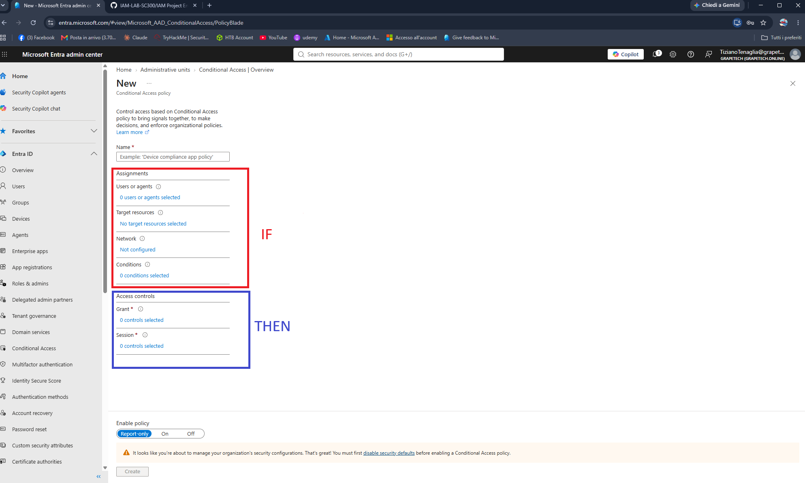
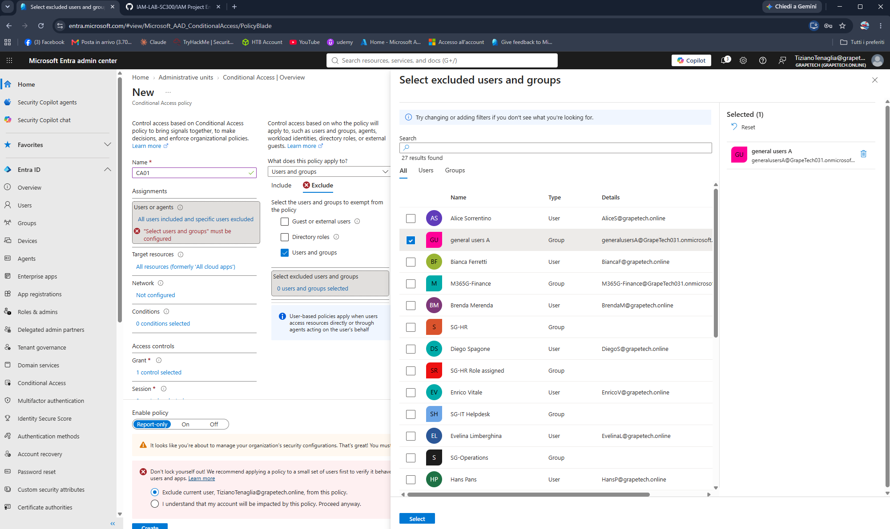
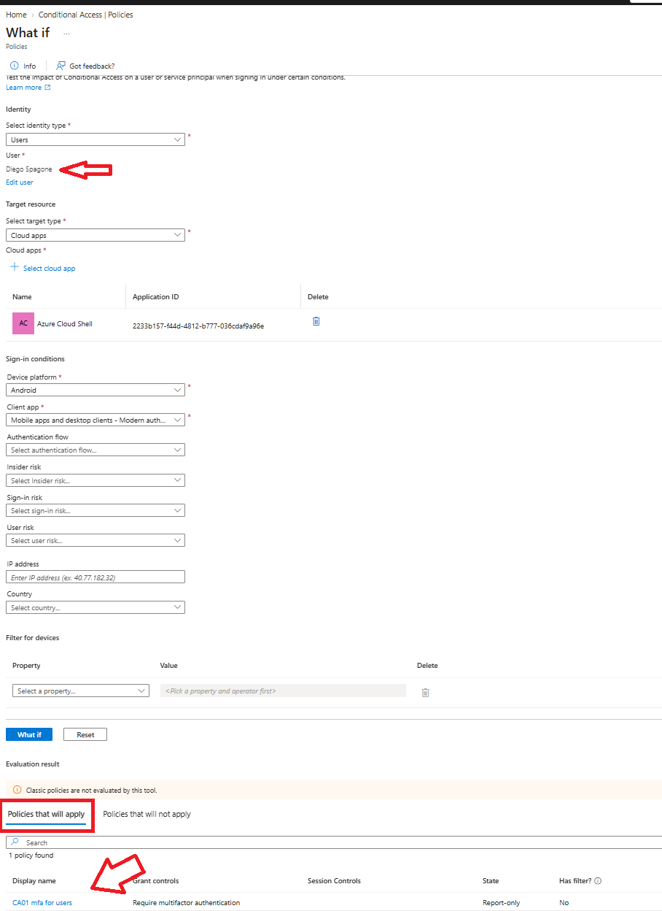
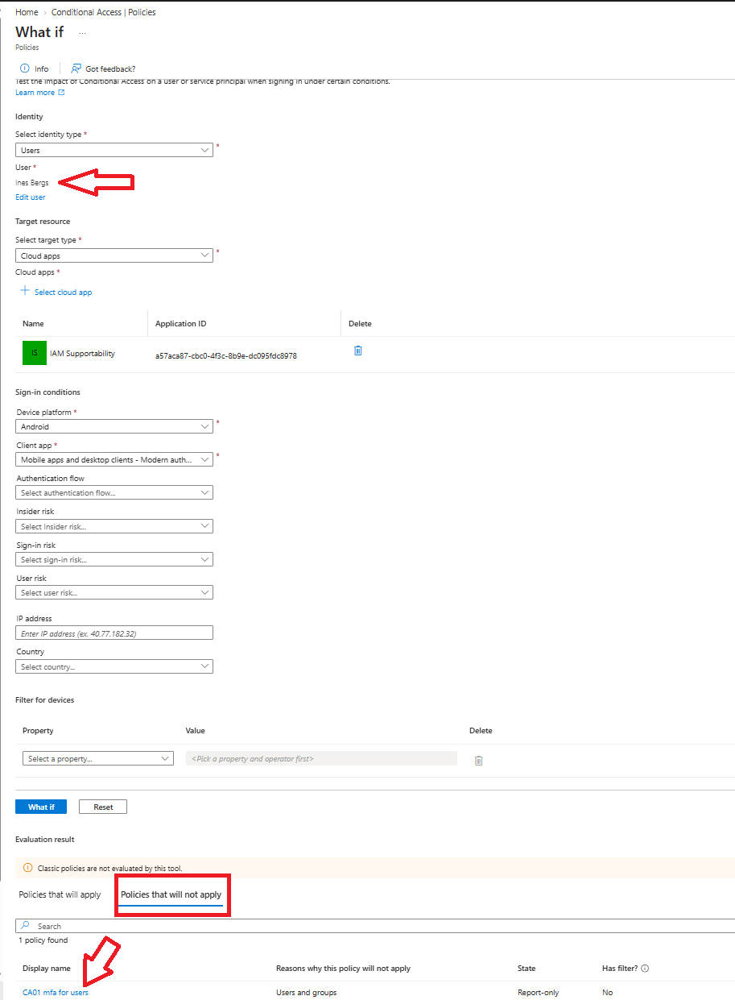

# Conditional Access: IF / THEN policy logic

- IF (Assignments) —  If every condition in this section is met during a sign-in attempt, the policy is triggered.

- THEN (Access controls) — the enforcement action applied once the IF conditions are satisfied: 
  a Grant control (e.g. require multifactor authentication, require a compliant device, block 
  access entirely) and/or a Session control (e.g. restrict session duration, enforce app 
  restrictions).

In other words: IF a sign-in matches these assignments, THEN apply these access controls. If any 
part of the IF section doesn't match a given sign-in (wrong user, wrong app, excluded group, etc.), 
the THEN controls are never applied for that sign-in.

*New Conditional Access policy screen, with the Assignments section outlined in red (the IF conditions: users, target resources, network, conditions) and the Access controls section outlined in blue (the THEN result: Grant and Session controls).*

## Creating CA01: Require MFA for all users

Built the first real Conditional Access policy, CA01, applying the IF/THEN structure described 
above:

IF (Assignments):
- Users or agents: Include → All users; Exclude → general users A (the group containing 
  both break glass/emergency access accounts).
- Target resources: All resources (formerly "All cloud apps").
- Network: not configured (no restriction).
- Conditions: none configured for this first policy.

THEN (Access controls):
- Grant: Require multifactor authentication.

Enable policy: set to Report-only, so the policy only logs what would happen without 
actually blocking any sign-in — the safest way to validate a new policy before turning it on.

Excluding the "general users A" group is critical here: since it contains the emergency access 
accounts, this guarantees that even a broad "require MFA for everyone" policy can never lock the 
break glass accounts out of the tenant, which would defeat their entire purpose.

*CA01 policy creation, Exclude tab, showing "general users A" selected as the only excluded group — the group containing both emergency access (break glass) accounts.*

## Testing with the "What If" tool

Used Entra ID's built-in What If tool to simulate 
sign-ins and confirm CA01 behaves exactly as designed, before ever turning it from Report-only to On.

Test 1: Diego Spagone (regular Member user, not in the excluded group)

Simulated a sign-in for Diego Spagone against a cloud app (Azure Cloud Shell). Result: CA01 appears 
under "Policies that will apply", with Grant controls = Require multifactor authentication, 
State = Report-only. This confirms the policy correctly targets ordinary users as intended.

*What If evaluation for Diego Spagone: CA01 "mfa for users" listed under Policies that will apply.*

Test 2: Ines Bergs (break glass / emergency access account)

Simulated a sign-in for Ines Bergs, one of the two break glass accounts, against a different cloud 
app (IAM Supportability). Result: CA01 appears under "Policies that will not apply", with the 
reason explicitly given as "Users and groups" — confirming the account is correctly excluded via 
membership in the "general users A" group.

*What If evaluation for Ines Bergs: CA01 "mfa for users" listed under Policies that will not apply, reason: Users and groups.*

Conclusion

The two tests together confirm CA01's IF/THEN logic is working exactly as designed: the policy 
applies its MFA requirement to regular users, while correctly bypassing the emergency access accounts 
that must never be blocked from signing in, even in a worst-case scenario.