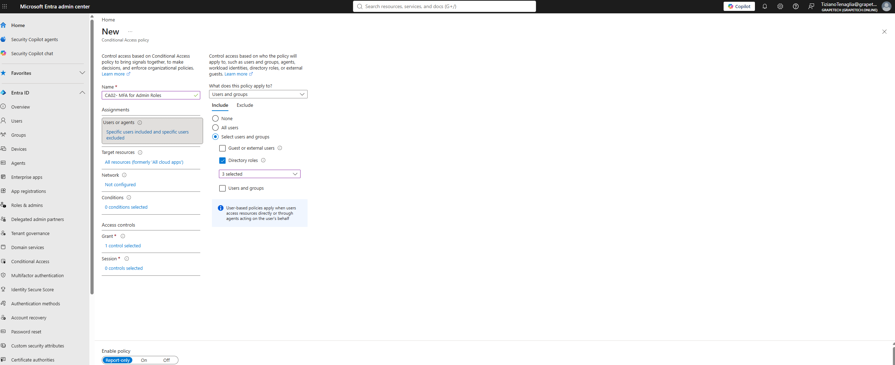
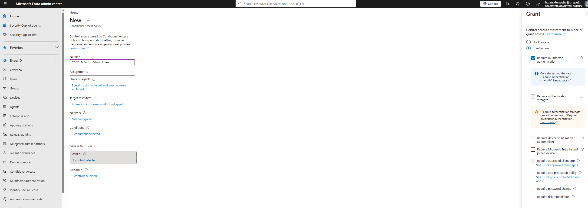

Policy CA02 - Require MFA for admin roles

What I did

Created the second Conditional Access policy, CA02, to enforce mandatory multi-factor authentication
specifically for privileged administrative roles, in addition to the broad "all users" MFA policy
already covered by CA01.

Why these 3 roles

Global Administrator, Privileged Role Administrator, and User Administrator are among the most
sensitive built-in roles in Entra ID: they can manage other administrators, reset passwords, and
change directory-wide security settings. Requiring MFA for sign-ins using these roles reduces the
risk of a single compromised admin credential leading to full tenant takeover.

Why exclude the break glass group

Same rationale as CA01: excluding "general users A" (the 2 emergency access accounts) guarantees
that even a policy targeting admin roles specifically can never lock the break glass accounts out of
the tenant.

*Grant panel for CA02, showing "Require multifactor authentication" checked under Grant access.*

