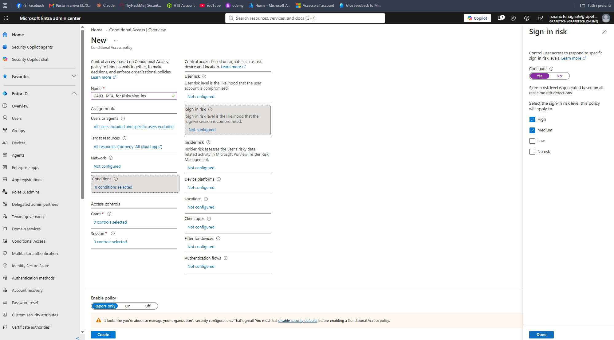
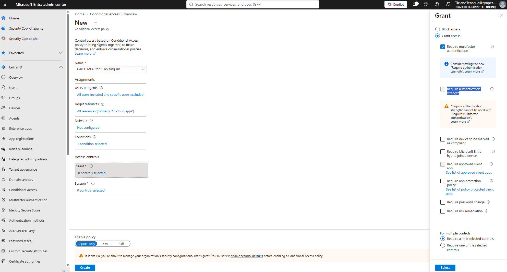

Conditional Access: CA03 - MFA for risky sign-ins

What I did

Created the third Conditional Access policy, CA03, leveraging Microsoft Entra ID Protection (P2
license) to automatically require MFA when a sign-in is flagged as medium or high risk - for example
an anomalous IP, an impossible travel pattern, or credentials found in a known leak. 

Why Sign-in risk instead of User risk

Sign-in risk evaluates the likelihood that a specific sign-in session is compromised (real-time
signals: anomalous IP, impossible travel, anonymous IP, malware-linked IP, etc.), while User risk
evaluates the likelihood that the user account itself has been compromised (e.g. leaked credentials
found on the dark web or user behaviour). 

Why Medium and High only

Restricting the policy to Medium and High risk levels keeps the MFA challenge targeted at
sign-ins Microsoft's risk engine is reasonably confident about, rather than triggering extra
authentication on every Low-risk signal, which would generate noise and user friction without a
meaningful security benefit.

*Grant panel for CA03, showing "Require multifactor authentication" checked under Grant access.*