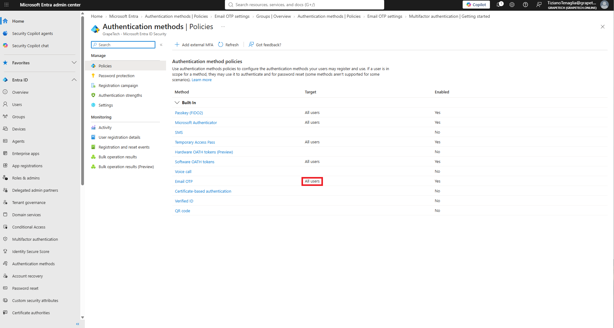
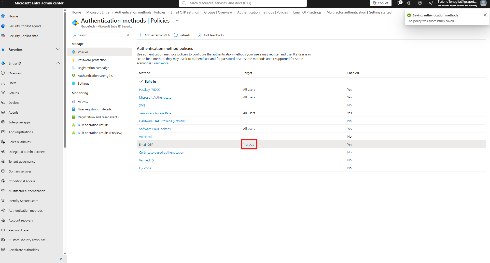

# Authentication methods

## What I did

Reviewed the Authentication method policies in Entra ID (Entra ID -> Authentication methods ->

Policies) to check which methods are enabled tenant-wide, and restricted Email OTP to guest users

only, since it's a weak factor meant for B2B guest redemption, not for internal member MFA.

## Methods overview

\- Passkey (FIDO2): phishing-resistant, passwordless hardware/platform security key.

\- Microsoft Authenticator: push notification / passwordless sign-in via the mobile app.

\- SMS: one-time code by text message. Weak, vulnerable to SIM swap and phishing.

\- Temporary Access Pass: time-limited passcode for onboarding or account recovery without a

&#x20; password.

\- Hardware OATH tokens (Preview): physical OTP fob/token. 

\- Software OATH tokens: TOTP codes from an authenticator app, used as a backup MFA method.

\- Voice call: automated call reading a verification code. Weak, phishing-prone.

\- Email OTP: one-time code sent by email, mainly for guest B2B invite redemption. **Enabled, now**

&#x20; **scoped to the "guest users A" group only.**

\- Certificate-based authentication: sign-in via client certificate/smartcard.

### Restricting Email OTP to guests

Changed the Email OTP method target from "All users" to the "guest users A" group, so internal

members can no longer register or use Email OTP as an MFA factor - they rely on Microsoft

Authenticator / Passkey instead - while external guests (like the B2B guest from Module 1.2) keep

using it for invite redemption.

\*Email OTP settings, Target changed from "All users" to the "guest users A" group - confirmation

banner "Saving authentication methods - The policy was successfully saved" visible top right.\*

