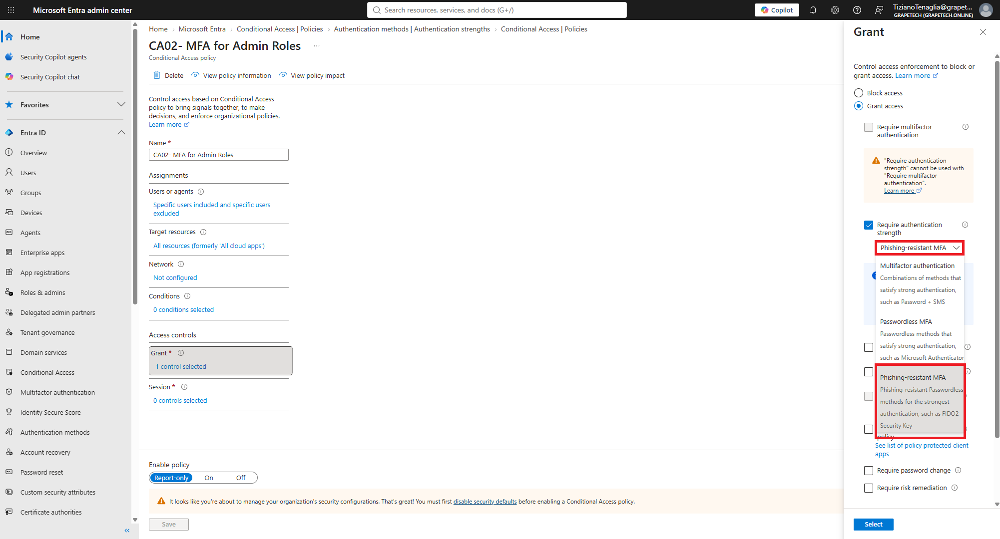

# Phishing-resistant MFA for CA02

## What I did

Updated CA02 (MFA for Admin Roles, check the folder 2.1 conditional access policies -> CA02  ) to use "Require authentication strength" -> Phishing-resistant

MFA, instead of the generic "Require multifactor authentication" grant.

## Why phishing-resistant MFA matters

Regular MFA can still be phished: an attacker uses a fake

login page to relay the password and one-time code in real time to the real Microsoft sign-in page

(in-the-middle attack), stealing the session even though MFA was "satisfied". Phishing-

resistant methods like Passkey (FIDO2) and certificate-based auth are cryptographically bound to the

real site's domain, so the credential simply doesn't work on a fake page - this attack becomes

impossible, not just harder, also microsoft HELLO can be another phishing resistant method.

This matters most for admin accounts specifically, since Global/Privileged/User Administrators are

the highest-value targets: a single phished admin session can lead to full tenant takeover.

*CA02 Grant panel, "Require authentication strength" selected with "Phishing-resistant MFA" chosen
from the dropdown, replacing the generic "Require multifactor authentication" control.*
