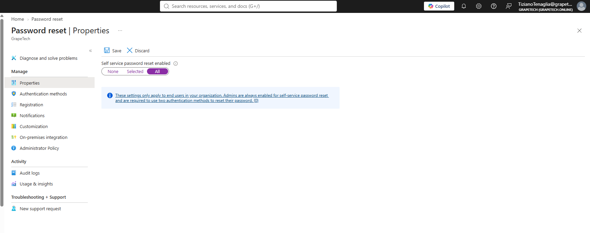
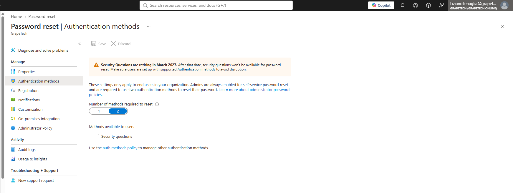
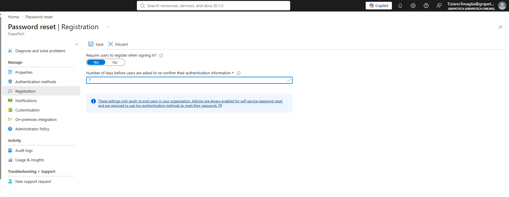
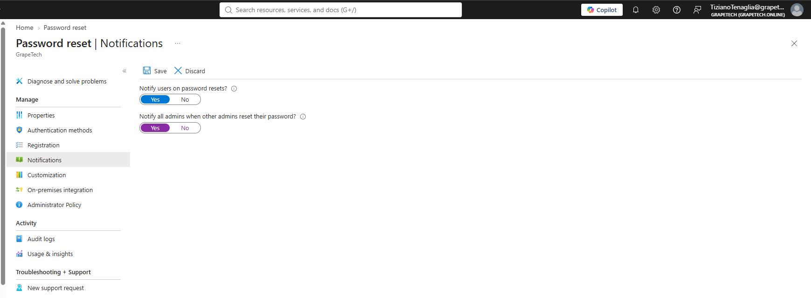

# Self-Service Password Reset (SSPR)

## What I did

### Configured SSPR in Entra ID (Entra ID -> Password reset) across the 4 main tabs: Properties,
Authentication methods, Registration, Notifications.

** Properties **

SSPR enabled for All users, with Number of methods required to reset set to 2, for stronger
verification before a password can be reset.

** Authentication methods **

Legacy tab, now mostly superseded by the unified Authentication methods policy configured earlier
(Module 3.1). Only "Number of methods required to reset" and the "Security questions" toggle remain
here - Security questions left disabled (weak, and retiring March 2027). All other methods
(Authenticator, Passkey, Email OTP scoped to guests, etc.) are inherited from the main auth methods
policy.

** Registration **

Requires users to register their SSPR methods the next time they sign in, so nobody is left without
a way to reset their own password later.

** Notifications **

Notifies users by email whenever their password is reset, and notifies all admins when another
admin resets their own password - both help spot unauthorized or suspicious resets quickly.

