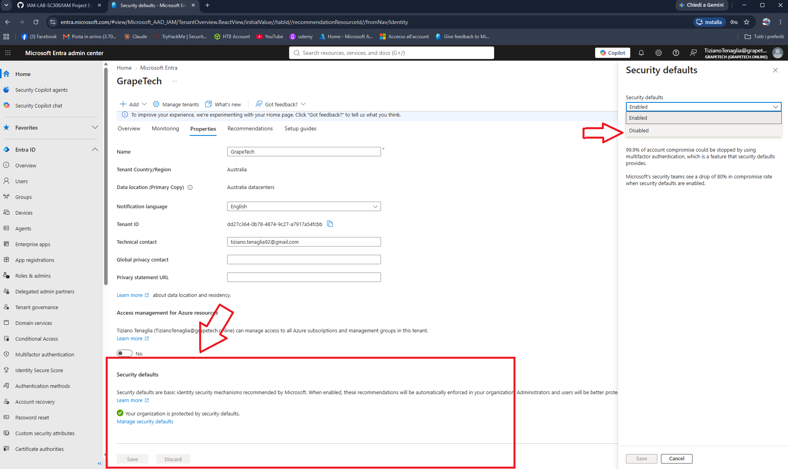

Security defaults vs. Conditional Access

## What are Security defaults

Security defaults are a set of basic, pre-configured identity protections that Microsoft enables 
automatically on new tenants at creation, at no extra cost. They require no 
licensing and no configuration — it's a simple on/off toggle with no customization.

They enforce:

- Multifactor authentication registration required for all users
- MFA required for administrators every sign-in
- MFA required for regular users when necessary (risk-based, decided by Microsoft)
- Blocking of legacy authentication protocols (IMAP, SMTP, POP3, older Office clients)
- Blocking of device code flow
- MFA required to access the Azure portal, Entra admin center, Azure PowerShell/CLI

## Why they need to be turned off

Security defaults and Conditional Access are mutually exclusive by design — CA is meant to fully 
replace security defaults with granular, customizable policies (per group, application, location, 
device, risk level, etc.), which security defaults can't provide since they're just an on/off switch.

keeping security defaults on, would be redundant and would prevent 
building custom policies. 

**Important**: Microsoft explicitly recommends *not* leaving the tenant unprotected during the 
switch — security defaults should only be disabled once equivalent (or better) Conditional Access 
policies are ready to take over, ideally immediately after disabling. Before touching this setting, 
the two break glass accounts (Module 1.3) should already be excluded from any future CA policy, so 
disabling security defaults never risks locking out emergency access.

## Next step

Disable Security defaults (Entra ID → Overview → Properties → Manage security defaults → Disabled), 
then immediately begin building Conditional Access policies to cover at least the same baseline 
protection (MFA for admins, MFA for all users, block legacy authentication) before expanding into 
more advanced, tailored policies.

*GrapeTech tenant Properties page confirming Security defaults are currently enabled, and access management for Azure resources is set to No.*