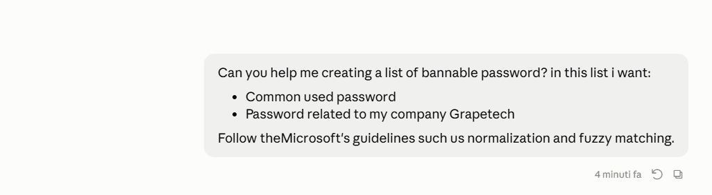
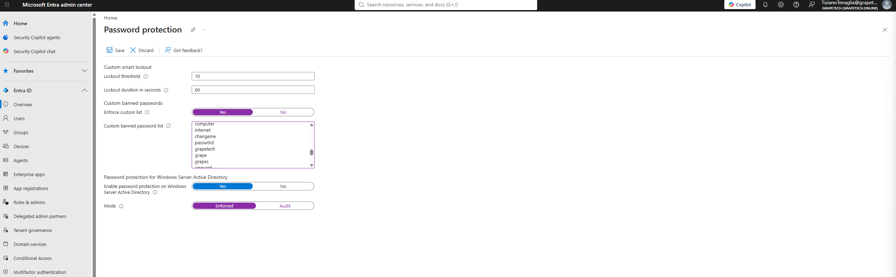

# Custom Banned Password List

## What Password Protection / Custom Banned Password List is for:

Entra ID Password Protection blocks users from setting weak or easily guessable passwords at
creation, reset, and change time. Microsoft already enforces a Global Banned Password List (common
breached/weak passwords, updated continuously from real-world attack data) on every tenant by
default - the Custom Banned Password List extends that with terms specific to this organization
(brand name, product names, local context) that Microsoft's global list obviously can't know about.

### Microsoft's guidelines: normalization and fuzzy matching

Before checking a password against the banned list, Entra ID normalizes it: converts to lowercase
and substitutes common leetspeak characters (@ -> a, 0 -> o, 1/! -> i, $ -> s, 3 -> e, etc.). It
then applies fuzzy matching (edit-distance based) to catch near-variants, and checks for the banned
term as a substring anywhere in the password. Because of this:

- There's no need to add multiple casing/leetspeak variants of the same word (e.g. "Grapetech",
  "GRAPETECH", "Gr4peTech") - normalization already catches those.
- There's no need to add year-suffixed versions ("Grapetech2026") - substring matching still flags
  it since "grapetech" appears inside the password regardless of what's appended.
- The list should stay short and made of root words rather than long and redundant - each entry
  covers many real-world variations automatically.

# What I did

### First of all i created a promp for my AI to help me in the creation of the list:

*Original request to Claude asking for a bannable password list combining common passwords and
GrapeTech-related terms, following Microsoft's normalization and fuzzy matching guidelines.*

### Then i went to Entra ID > Password protection and configured:

- Enforce custom list: Yes.
- Custom banned password list: populated with two categories of terms -
  1. Common breached/weak passwords - these supplement Microsoft's own global list.
  2. GrapeTech-specific terms - the company name and brand-related words, plus terms tied to this project specifically-admin/personal
     names and location are included because users very commonly base weak passwords on
     familiar names they see around them (IT staff, city, department).
- Password protection for Windows Server Active Directory: Enable = Yes, Mode = Enforced - turned
  on proactively, the setting is already in place for when the Hybrid/on-prem module is tackled later.
- Custom smart lockout: Lockout threshold = 10, Lockout duration in seconds = 60 - left
  at default values, not the focus of this module but relevant context since it lives on the same
  settings page and works alongside the banned list to slow down brute-force attempts.

*Password protection page: Custom smart lockout (threshold 10, duration 60s), Custom banned
passwords - Enforce custom list = Yes, Custom banned password list populated with common and
GrapeTech-related terms, Password protection for Windows Server Active Directory enabled with Mode
= Enforced.*

