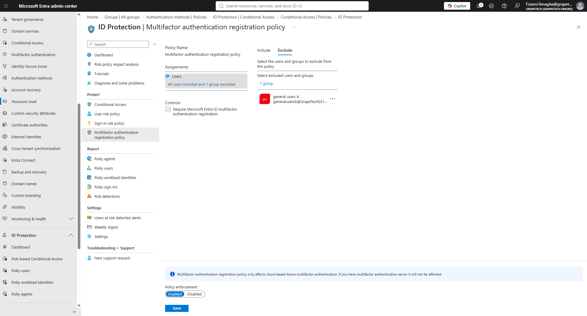
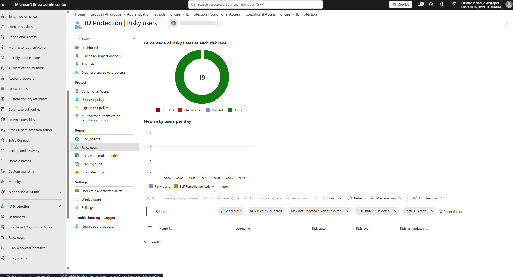
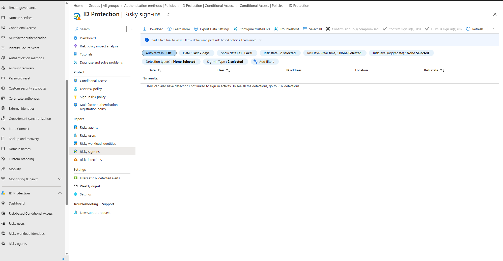

# Identity Protection

## What is Identity Protection

Microsoft Entra ID Protection is the risk engine behind Entra ID: it continuously analyzes sign-ins
and user accounts using Microsoft's threat intelligence (leaked credential databases, anomalous
travel, anonymous/malicious IPs, malware-linked activity, etc.) and assigns each one a risk level
(Low, Medium, High). Those risk signals can then be consumed in two ways: as a condition inside
Conditional Access policies (the modern approach, already used in CA03 to require MFA on
medium/high sign-in risk), or reviewed directly here in the Identity Protection reports (Risky
users, Risky sign-ins, Risk detections) to investigate and remediate suspicious activity.

## What I did

1. Enabled the MFA registration policy, which forces users to register MFA the next time they sign
   in if they haven't already, instead of leaving them unprotected until they get randomly
   challenged.
2. Reviewed the Risky sign-ins and Risky users reports to confirm the monitoring is active and to
   document what the interface shows.

## MFA registration policy

Policy enforcement: Enabled. Assignments: All users included, with the "general users A" group
(the 2 break glass accounts) excluded - same rationale as every other policy in this project:
emergency access accounts must never be forced through extra registration steps that could lock
them out.

*ID Protection - Multifactor authentication registration policy, Policy enforcement: Enabled,
Assignments: All users included, Exclude tab showing "general users A" (1 group) excluded.*

## Risky sign-ins / Risky users

Both reports currently show no risky activity ("No results" on Risky sign-ins, all 19 users at "No
Risk" on Risky users) - expected for a clean lab tenant with no real malicious traffic. The
important part for this project is knowing where these reports live and what actions are available
on a flagged entry: Confirm compromised, Confirm safe, Dismiss risk, Reset password.

*ID Protection - Risky users report, donut chart showing all 19 users at "No Risk", table showing
"No Results" for the active risk state filter.*

*ID Protection - Risky sign-ins report, filtered on the last 7 days, showing "No results" - no
suspicious sign-in activity detected in this lab tenant.*
