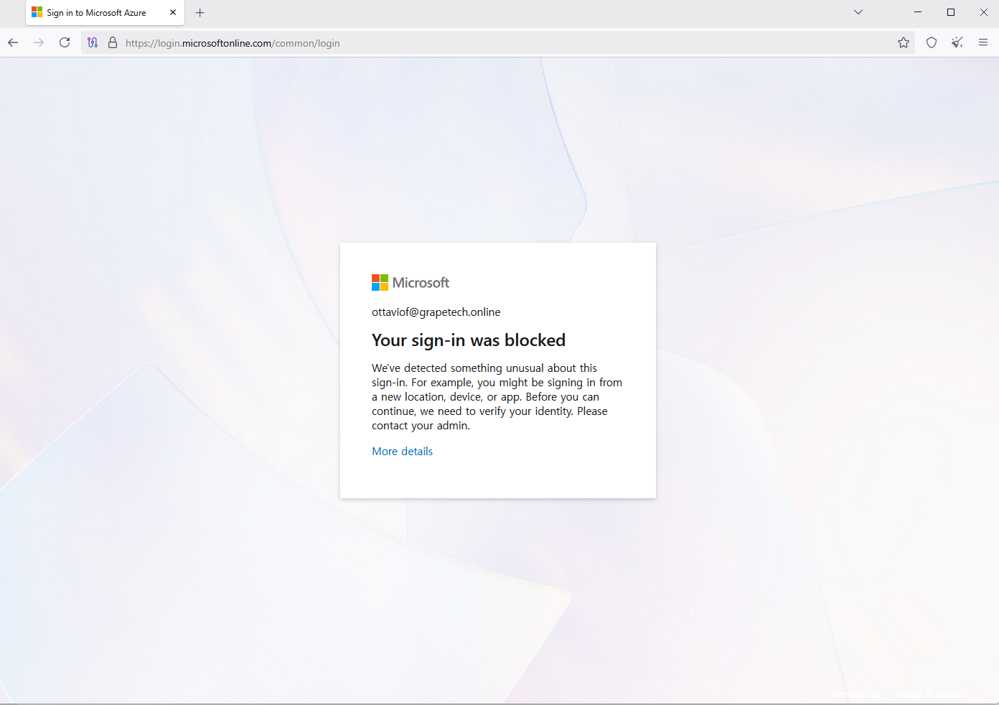
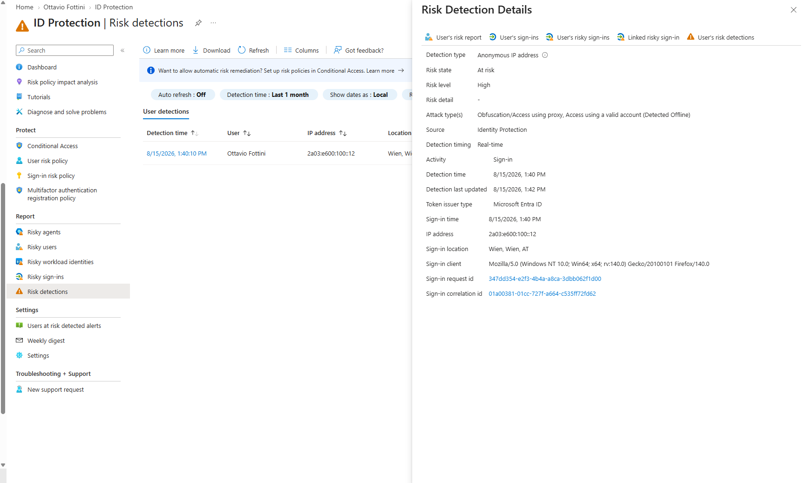
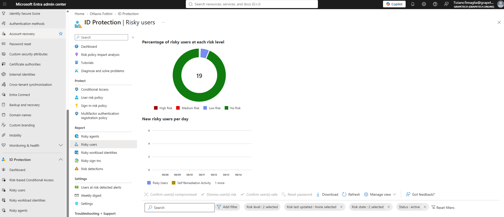

# Testing risk detection with Tor Browser

## What I did

To generate real Identity Protection risk data instead of empty reports, I deliberately triggered a
risk detection by signing in through the Tor network, which routes traffic through anonymizing exit
nodes that Microsoft's threat intelligence recognizes as anonymous/high-risk IP addresses.

I Opened Tor Browser, connected to the Tor network, and navigated to https://login.microsoftonline.com to sign in as Ottavio Fottini.

## Result

The sign-in was blocked outright by Microsoft, before even reaching the password/MFA.
This is Microsoft's built-in high-confidence risk protection, which can block a sign-in automatically when the detected risk is severe enough 
(in this case, the Tor exit node IP being flagged).

This confirms Identity Protection is actively evaluating sign-ins on this tenant and reacting to real anomalous signals, not just a theoretical configuration.

*Microsoft sign-in page in Tor Browser, showing "Your sign-in was blocked" for ottaviof@grapetech.online,
triggered by an anomalous/anonymous IP risk detection from the Tor exit node.*

# Confirming the detection in Identity Protection

Then i went back into my entra ID as Global administrator (TizianoTenaglia@grapetech.online) and clicked on the Risk Detection Blade

Risk Detection Details for the event:
- **Detection type**: Anonymous IP address
- **Risk state**: At risk
- **Risk level**: High
- **Attack type**: Obfuscation/Access using proxy, Access using a valid account (Detected Offline)
- **Source**: Identity Protection
- **Detection timing**: Real-time
- **IP address**: 2a03:e600:100::12
- **Sign-in location**: Wien, Wien, AT (the Tor exit node's apparent geolocation)
- **Sign-in client**: Firefox on Windows (Tor Browser's user agent)

*ID Protection - Risk detections report, showing the "Anonymous IP address" detection for Ottavio
Fottini with full details: Risk level High, Attack type Obfuscation/Access using proxy + Access
using a valid account (Detected Offline), Detection timing Real-time, IP 2a03:e600:100::12,
location Wien, Wien, AT.*

Went back to Risky users afterward: the donut chart now shows a small Low Risk slice alongside the
18 "No Risk" users (Ottavio Fottini), confirming the detection also fed into the aggregate score,
even though the individual detection itself was flagged High.

*ID Protection - Risky users report, donut chart now showing a small Low Risk slice among the 19
users, confirming the aggregate risk score picked up the detection.*