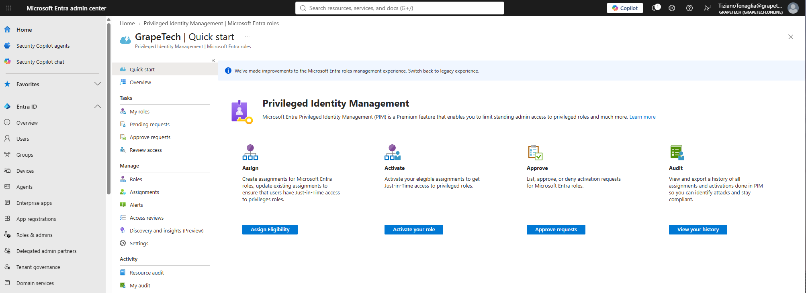
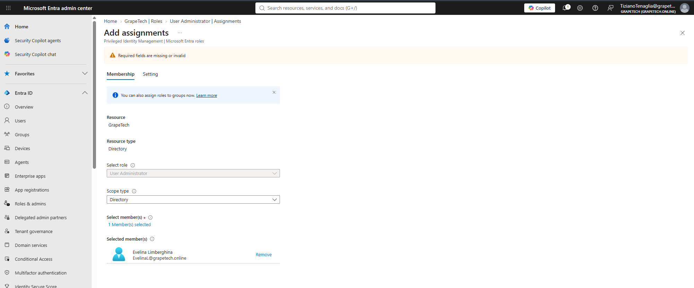
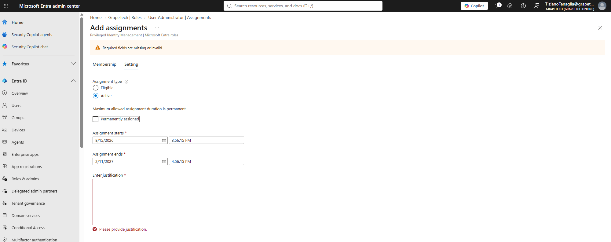
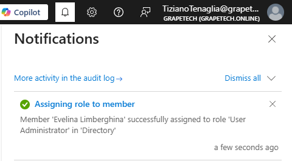

# Privileged Identity Management (PIM): eligible assignment

## What is PIM

Privileged Identity Management manages just-in-time access to privileged roles instead of leaving
them permanently active on an account. It's organized around 4 tasks:

- **Assign**: where admins create role assignments (Eligible or Active) for users, deciding who CAN hold a privileged role and under what conditions.
- **Activate**: where a user with an Eligible assignment requests to actually turn the role on for a limited time window, when they genuinely need it.
- **Approve**: where a designated approver reviews and accepts/denies pending activation requests before the role becomes active.
- **Audit**: a full history log of every assignment and activation, used to review who had access to what and when, for compliance and incident investigation.

## Assigning Evelina Limberghina as User Administrator

Created a PIM assignment: Resource = GrapeTech (directory), Role = User Administrator, Member =
Evelina Limberghina. Scope type left as Directory (not restricted to an Administrative Ubnit), because as HR
Manager she occasionally needs to create or modify user accounts and manage passwords as part of
onboarding/offboarding - a legitimate business reason to be eligible for this role, even though she
doesn't need it active at all times.

*Add assignments, Membership tab: Resource GrapeTech, Resource type Directory, Role User
Administrator, Selected member Evelina Limberghina (EvelinaL@grapetech.online).*

## Eligible vs Active

**Active assignment** grants the role immediately for the whole assignment window, with no extra step
required to use it - it's effectively standing access, and the portal required a justification and
fixed start/end dates just to create it, which defeats the point of least privilege (the role would
just sit "on" the whole time). **Eligible assignment** grants nothing by default: the user only sees the
role as available and must explicitly Activate it when they actually need it, typically going
through MFA, justification, and (if configured) approval - meaning the role is only "live" for the
short window it's actually being used, drastically reducing the attack surface.

*Add assignments, Setting tab with Assignment type = Eligible selected: only requires start/end
dates (or Permanently eligible), no justification needed at assignment time - the role isn't active
yet, just available to request later.*

*Add assignments, Setting tab with Assignment type = Active selected: requires fixed Assignment
starts/ends dates and a mandatory justification just to create the assignment - shown here with the
validation error since justification was left empty.*

## Confirmation

The assignment completed successfully: notification "Assigning role to member - Member 'Evelina
Limberghina' successfully assigned to role 'User Administrator' in 'Directory'".

*Notifications panel confirming: "Member 'Evelina Limberghina' successfully assigned to role 'User
Administrator' in 'Directory'".*