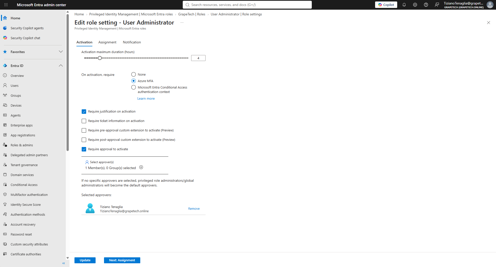
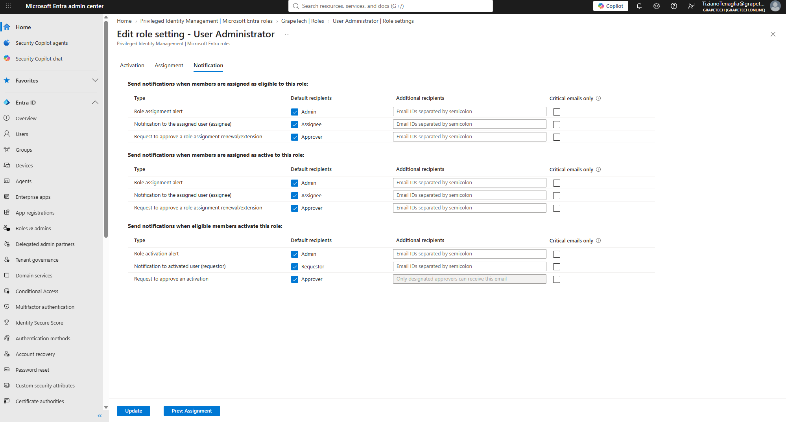

# PIM Role settings for User Administrator

## Activation tab

- Activation maximum duration: 4 hours - once activated, the role auto-expires after this window.
- On activation, require: Azure MFA - Evelina must complete MFA when activating, not just when
  signing in.
- Require justification on activation: she has to type a reason each time she activates.
- Require approval to activate:Tiziano Tenaglia set as the approver, so the role only turns on after admin approval, not automatically.

*Edit role setting - User Administrator, Activation tab: 4 hour max duration, Azure MFA required,
Require justification on activation and Require approval to activate both checked, Tiziano
Tenaglia listed as the selected approver.*

## Notification tab

Default email notifications left enabled for all three scenarios: when someone is assigned eligible
to the role, when someone is assigned active to the role, and when an eligible member activates the
role. Each scenario notifies the Admin, the Assignee/Requestor, and the Approver by default - keeps
everyone in the loop (admin sees new assignments, Evelina gets confirmation, Tiziano gets pinged
whenever there's an activation to approve).

*Edit role setting - User Administrator, Notification tab: default recipients (Admin, Assignee,
Approver / Admin, Requestor, Approver) enabled across eligible attivation, and
role activation notifications.*