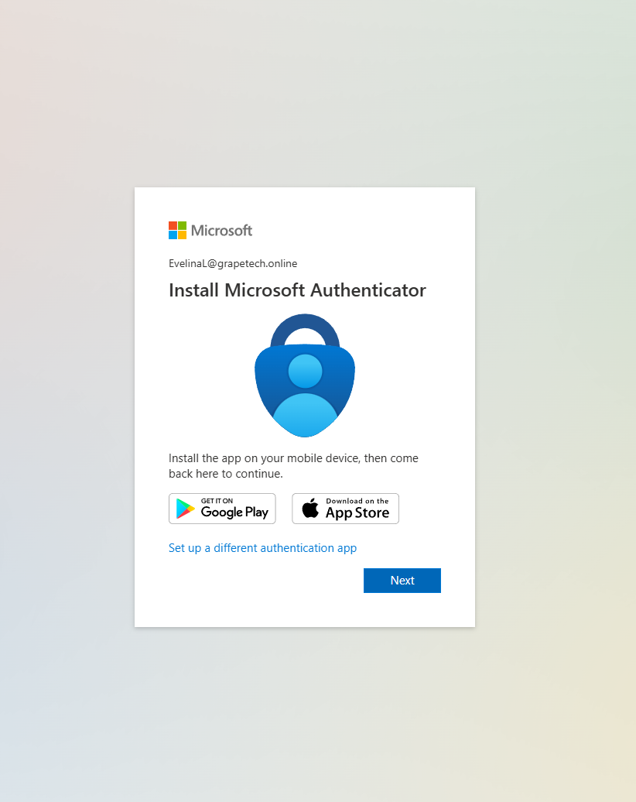
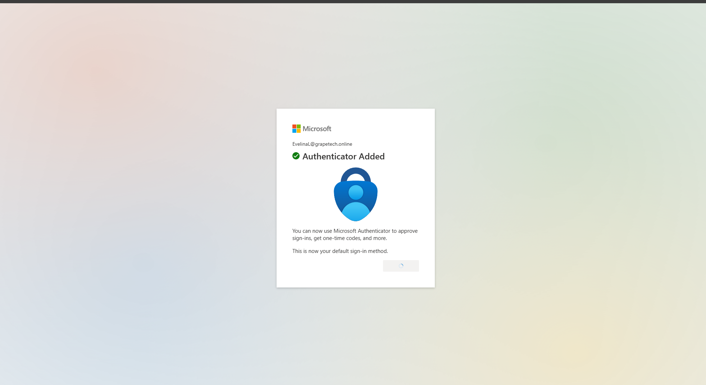
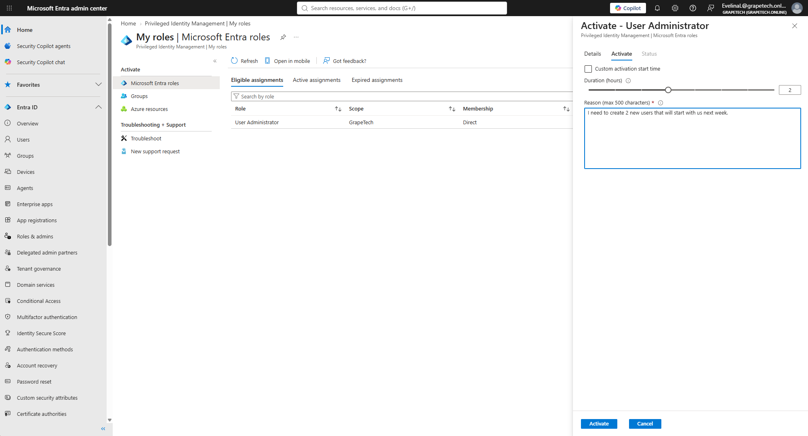
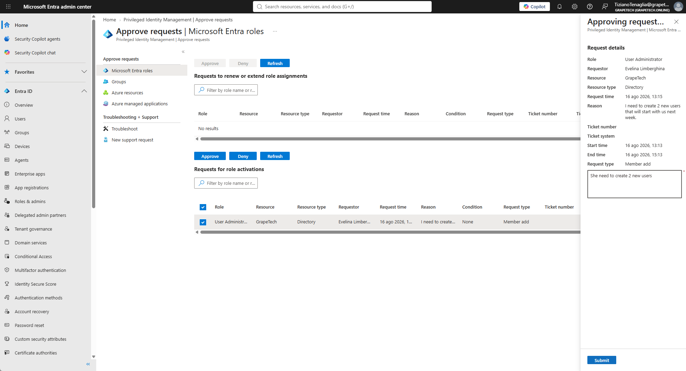
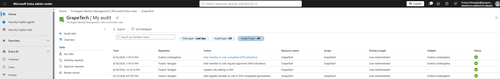

# PIM end-to-end test: activation request, approval, audit

## What I did

Ran the full PIM cycle from start to finish using Evelina Limberghina's Eligible assignment on User
Administrator: first login and MFA registration, activation request with justification, approval by
Tiziano Tenaglia, and final confirmation via the PIM audit log.

1. First login as Evelina

Signed in as EvelinaL@grapetech.online for the first time. Since she had no MFA method registered
yet, Entra required her to set one up before continuing - prompted to install Microsoft
Authenticator on a mobile device.

*First sign-in as EvelinaL@grapetech.online, prompted to "Install Microsoft Authenticator" before
being allowed to continue.*

2. MFA registration completed

Finished pairing Microsoft Authenticator - confirmation screen "Authenticator Added", now set as her
default sign-in method. This unblocked her from completing any future MFA challenge, including the
one required to activate the PIM role.

*Confirmation screen "Authenticator Added" - Microsoft Authenticator set as Evelina's default
sign-in method.*

3. Activation request

Went to PIM > My roles > Eligible assignments > User Administrator > Activate. Set Duration to 2
hours and entered the required Reason: "I need to create 2 new users that will start with us next
week." Submitted the request, which went into Pending approval status.

*My roles > Eligible assignments > Activate - User Administrator panel: Duration 2 hours, Reason
"I need to create 2 new users that will start with us next week."*

4. Approval by Tiziano

Signed back in as tiziano.tenaglia > PIM > Approve requests > found Evelina's request under
"Requests for role activations" (Role: User Administrator, Resource: GrapeTech, Reason: her
justification). Added an approval note ("She need to create 2 new users") and clicked Submit to
approve.

*Approve requests > Microsoft Entra roles: Evelina's pending activation request for User
Administrator, with Request details panel open and approval note.*

5. Audit confirmation

Checked PIM > Microsoft Entra roles > My audit, filtered to the last day: shows the complete
sequence with all 4 actions logged as Succeeded - eligible assignment creation, role setting
update, activation request approved (Tiziano), and activation completed (Evelina) - each timestamped
and tied to the User Administrator role on GrapeTech.

*PIM > My audit, Time span: Last day - full sequence of Succeeded actions: eligible assignment
created, role setting updated, activation request approved by Tiziano, activation completed by
Evelina.*