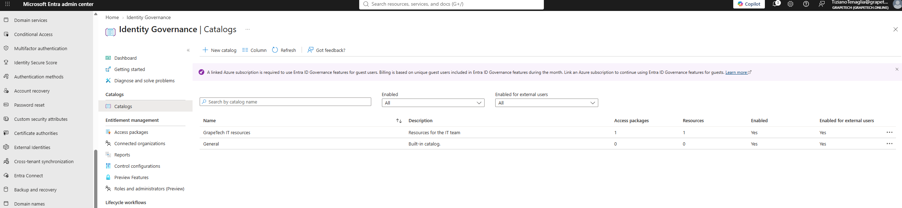
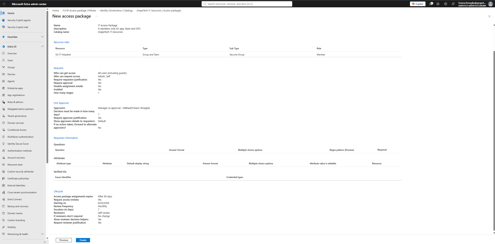

# Entitlement Management: catalog and access package 

## What is Entitlement Management

Entitlement Management automates access requests: instead of an admin manually adding people to
groups/apps/sites one by one, users request access themselves through a self-service portal
(myaccess.microsoft.com), the request goes through an approval workflow, and access automatically
expires or gets reviewed on a schedule.

### Catalog vs Access package

A Catalog is a container that groups related resources (groups, apps, SharePoint sites) so they can
be managed together - think of it as a folder. An Access package is the actual request-able bundle
built from resources inside a catalog, with its own policy defining who can request it, who
approves, and when it expires. The catalog organizes what resources exist; the access package is
what an end user actually sees and requests.

*New catalog panel: Name "GrapeTech IT resources", Enabled for users to request = Yes, Enabled for
external users to request = No at creation (changed to Yes afterward).*

### Access package: "IT Access Package" and Lifecycle

The overall goal for this package's settings is to reduce the admin's day-to-day workload without
losing control over who ends up with access: instead of an admin manually approving and tracking
every single request forever, the policy leans on self-service plus the Lifecycle/Access Reviews
settings below to keep things in check automatically.
Access package assignments expire after 90 days, not permanent, forces periodic reconfirmation
instead of access silently piling up forever. Access Reviews enabled on top of that: Monthly
frequency, 7-day review duration, Reviewers = Self-review, to diminuish the the overhead no change if reviewer
doesn't respond (it could also been activated to remove users that do no complete the review), reviewer decision helpers shown,and reviewer justification required.

*Identity Governance | Catalogs list: "GrapeTech IT resources" showing 1 Access package and 1
Resource, Enabled = Yes, Enabled for external users = Yes.*