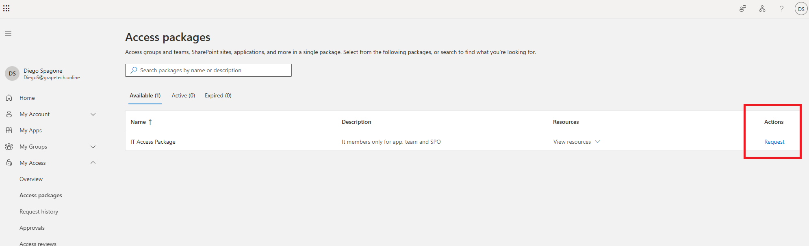
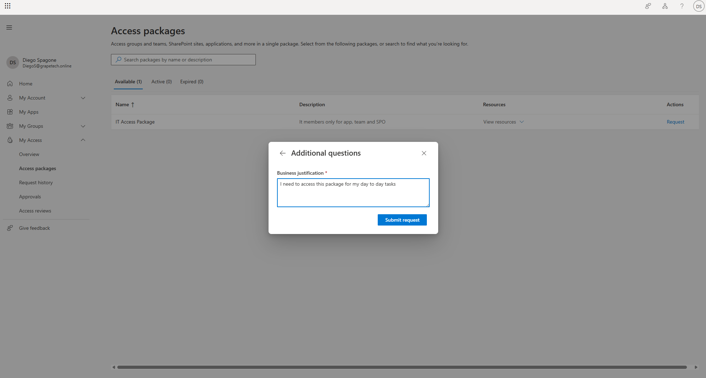
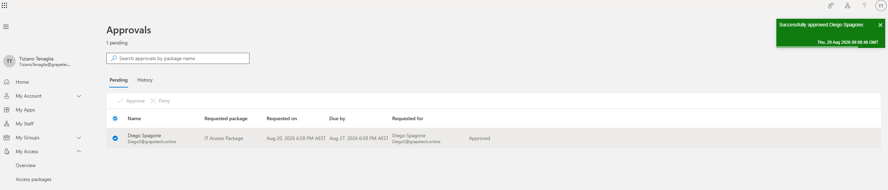
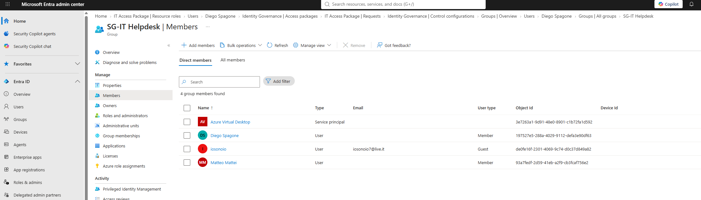

# Entitlement Management: end-to-end request test

## What I did

Ran the full self-service flow for the "IT Access Package" from request to verified access, using
Diego Spagone as the requester, and Tiziano Tenaglia as the
approver.

### 1. Request and justification

Signed in as Diego Spagone on myaccess.microsoft.com > My Access > Access packages. "IT Access
Package" showed up under Available (1), Active (0), Expired (0), confirming he was in scope to
request it. Clicked Request.

An "Additional questions" prompt asked for the required Business justification: entered "I need to
access this package for my day to day tasks" and clicked Submit request.

### 2. Approval

Diego has no Manager set on his user profile, so the request automatically routed to the fallback
approver, Tiziano Tenaglia, instead of stalling on a missing manager. Signed in as Tiziano on
myaccess.microsoft.com > My Access > Approvals, found Diego's pending request for "IT Access
Package", and approved it - confirmation toast "Successfully approved Diego Spagone", request status
updated to Approved.

### 3. Verification

Double-checked the actual result in Entra admin center: Groups > SG-IT Helpdesk > Members now lists Diego
Spagone as a direct Member, alongside the group's other existing members.
This confirms the access package correctly provisioned real group membership automatically after approval - no manual admin step
was needed to add him to the group.

