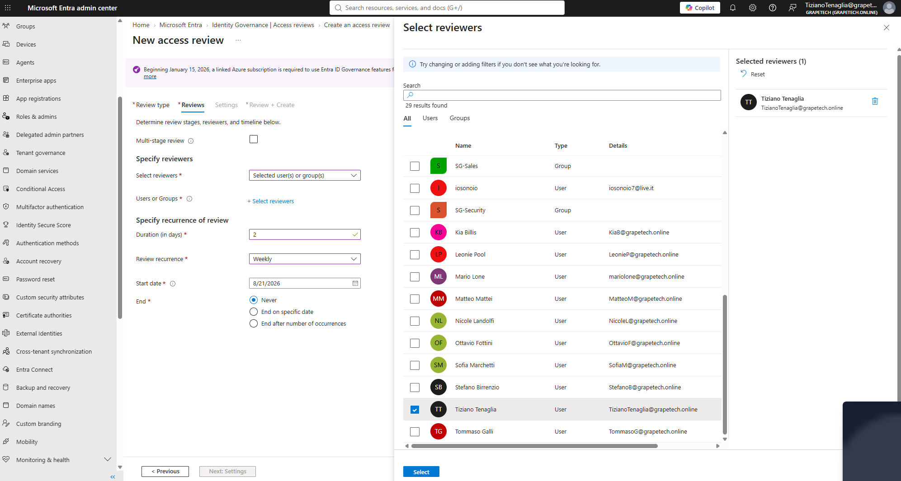
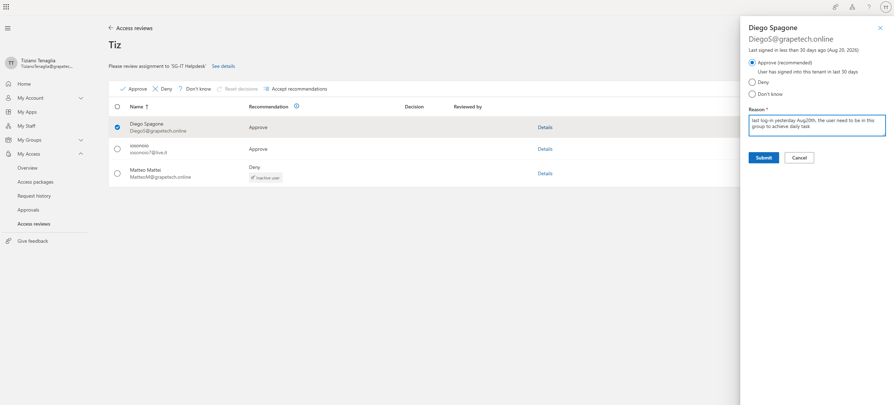
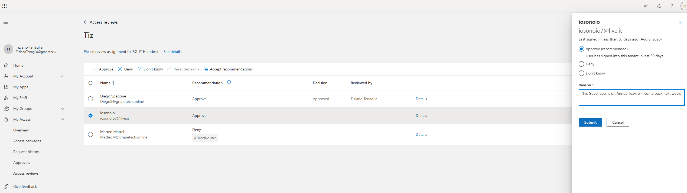
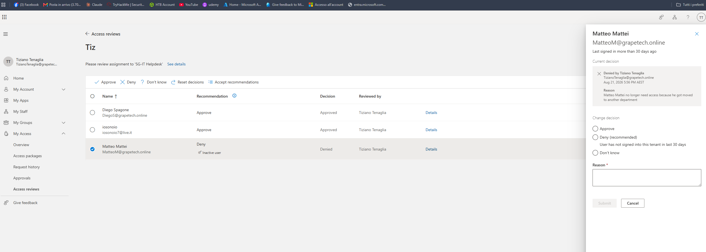
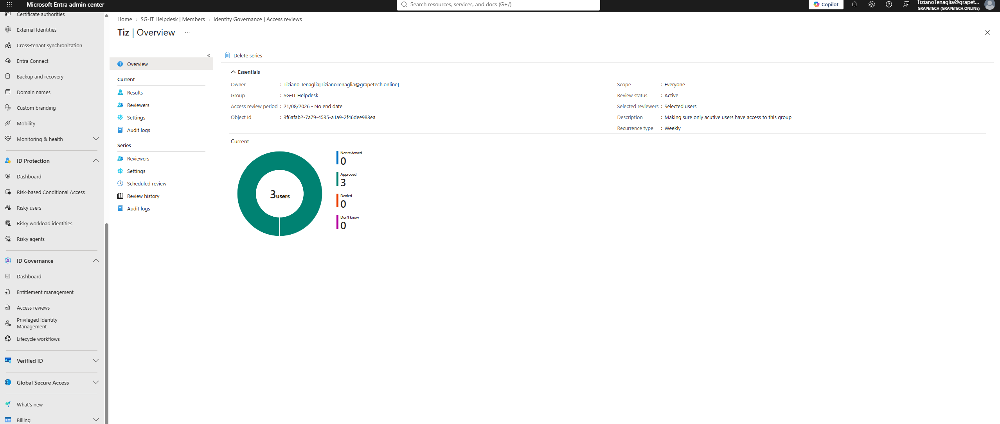

# Access Review: Reviewer Tiziano Tenaglia on SG-IT Helpdesk Group

## What I did

Created a standalone Access Review (separate from the one baked into the Entitlement Management
access package) targeting the SG-IT Helpdesk group directly, then went through it as reviewer to
decide who keeps access.

### ***Creating the review***

- Review type: Teams + Groups, scoped to the group SG-IT Helpdesk.
- Reviewers: Selected user(s) - Tiziano Tenaglia set as the reviewer.
- Duration: 2 days per review instance.
- Review recurrence: Weekly, starting 8/21/2026, End: Never.
- Scope: Everyone in the group.
- Description: "Making sure only active users have access to this group."

Confirmed in Overview: Owner Tiziano Tenaglia, Group SG-IT Helpdesk, Access review period
21/08/2026 - No end date, Review status Active, Recurrence type Weekly.

*New access review wizard, Reviews tab: Select reviewers panel with Tiziano Tenaglia chosen,
Duration 2 days, Review recurrence Weekly, Start date 8/21/2026, End = Never.*

### ***Reviewing the 3 members***

Went through the review as reviewer via myaccess.microsoft.com (this
is where reviewer decisions are actually made - the admin center Results page is read-only unless
you're acting through this end-user portal), and decided each case individually instead of just
accepting the system's default recommendations:

- Diego Spagone - Approve: last login was the day before (Aug 20), and he needs the group to carry
  out his daily tasks.

*myaccess.microsoft.com, Diego Spagone's decision panel: Approve (recommended) selected, Reason
"last log-in yesterday Aug20th, the user need to be in this group to achieve daily task".*

- iosonoio (guest) - Approve: currently on annual leave, coming back the following week - a
  temporary absence isn't a reason to revoke access that's still needed.

*myaccess.microsoft.com, iosonoio's decision panel: Approve selected despite the guest being
inactive, Reason noting he's on annual leave and returning the following week.*

- Matteo Mattei - Deny: moved to another department, so he no longer needs access to this group.

*myaccess.microsoft.com, Matteo Mattei's decision panel: Current decision "Denied by Tiziano
Tenaglia", Reason "Matteo Mattei no longer need access because he got moved to another
department".*

### ***In conclusion***

This screen represents the completion of the access review cycle: all 3 members of the SG-IT
Helpdesk group received an explicit decision (nobody was left as "Not reviewed"), confirming that
the review process was carried through correctly end-to-end - from creating the review, to
individually evaluating each user, all the way to closing out the current cycle with a result that
is tracked and verifiable on this summary page.

*"Tiz" | Overview: Group SG-IT Helpdesk, Access review period 21/08/2026 - No end date, Review
status Active, Scope Everyone, Description "Making sure only active users have access to this
group", 3 users in scope.*

