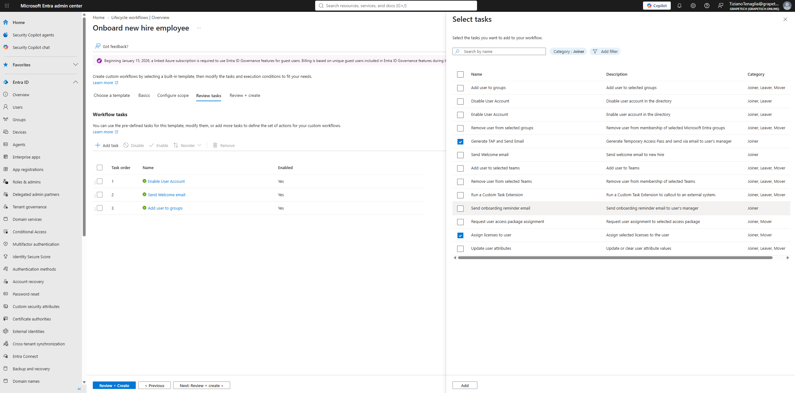
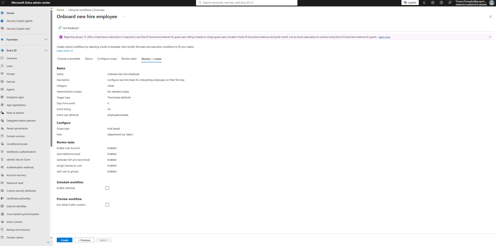
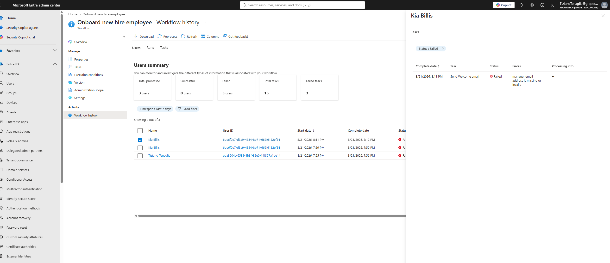
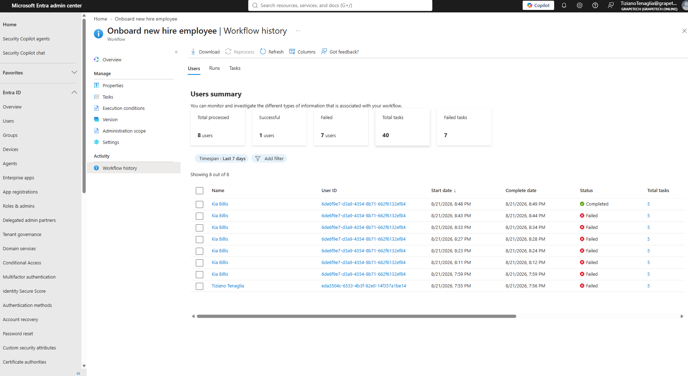
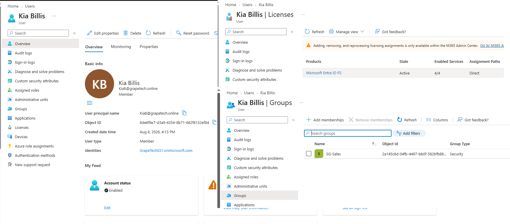

# Lifecycle Workflows: "Onboard new hire employee" (Joiner)

## What is a Lifecycle Workflow

Unlike Entitlement Management (which is request/approval driven), Lifecycle Workflows are pure
automation: a sequence of tasks runs automatically for a user based on a trigger 
or on demand, with no request or approval involved. 
The idea is that as soon as someone is scoped into the workflow, the system prepares their account for day one
without an admin doing every step by hand.

### Building the workflow

Started from the built-in "Onboard new hire employee" template and customized it:

- Trigger: Time based attribute, Event user attribute = employeeHireDate, Days from event = 0,
  Event timing = On.
- Scope: Rule based, rule = (department eq 'Sales') - only new hires in the Sales department are
  processed by this workflow.
- Tasks: kept the 3 default tasks (Enable User Account, Send Welcome email, Add user to groups ->
  configured to add SG-Sales) and added 2 more via "+ Add task": Generate TAP and Send Email
  (generates a Temporary Access Pass and emails it to the user's manager) and Assign licenses to
  user (configured to assign Microsoft Entra ID P2). Reordered so Generate TAP and Send Email runs
  before Add user to groups.
- Final task order: Enable User Account -> Send Welcome email -> Generate TAP and Send Email ->
  Assign licenses to user -> Add user to groups, all Enabled.

### Testing and troubleshooting

Ran the workflow on demand multiple times against the test user Kia Billis (and once accidentally
against my own admin account, Tiziano Tenaglia) while debugging. Out of 8 total runs, 7 failed
before the 8th finally completed successfully. The errors encountered, in order:

1. "Manager attribute is missing or invalid" - Kia Billis had no Manager set on her user profile at
   all. Fix: Users > Kia Billis > Properties > Job information > set Manager to Tiziano Tenaglia.
2. "Manager email address is missing or invalid" - even after assigning a manager, the task still
   failed, because the manager's (my own) Contact Information > Email field was empty - the
   Manager attribute pointed to a valid account, but that account had no actual email address on
   file for the notification to be sent to. Fix: Users > Tiziano Tenaglia > Properties > Contact
   Information > populated the Email field.
3. "TAP authentication not valid for this user" - appeared on an intermediate run while the earlier
   issues were still being resolved; stopped reoccurring once the manager and manager-email issues
   were fixed and the workflow was reprocessed, so it was most likely a downstream side effect of
   the earlier failures rather than a separate root cause.

After fixing the manager and manager-email issues and using Reprocess on each attempt, the run at
8:48-8:49 PM finally completed successfully, all 5 tasks Succeeded.

### How to avoid this next time

- Before enabling any Joiner workflow that includes manager-dependent tasks (Send Welcome email,
  Generate TAP and Send Email, Send onboarding reminder email),i will make sure every new hire actually
  has a Manager assigned, and that the manager account itself has a valid Email set in Contact
  Information - not just a UPN. UPN and Email are two different fields; having one populated
  doesn't guarantee the other is.
- Add "Manager" and "Email" as required columns in future bulk-create CSV templates, so this is
  caught at user-creation time instead of discovered later when a workflow fails.
- Use the "Run What if after creation" option on the Review + create step (left unchecked this
  time) to simulate the workflow against real users before actually running it live - it flags
  these kinds of missing-attribute problems without generating a failed run in the history.
- When troubleshooting, fix one issue at a time and Reprocess immediately after each fix, rather
  than changing multiple things at once - this is what made it possible to tell exactly which fix
  resolved which error.

## That's the definitive proof:

The next screenshot proof that everthing went as requested for the onboring procedure, Kia has now an enabled account,
she recieved a welcome email, and a TAP for her first login,a the P2 license assigned and she is part of the Sales Group

 
