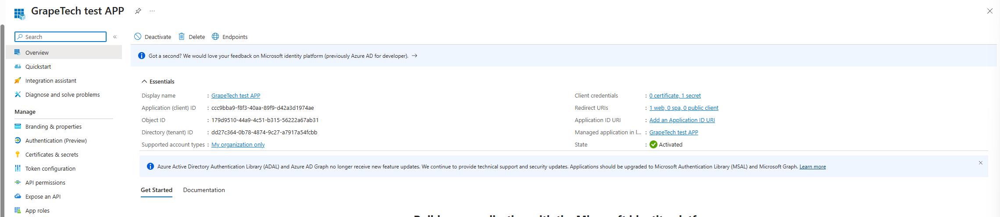
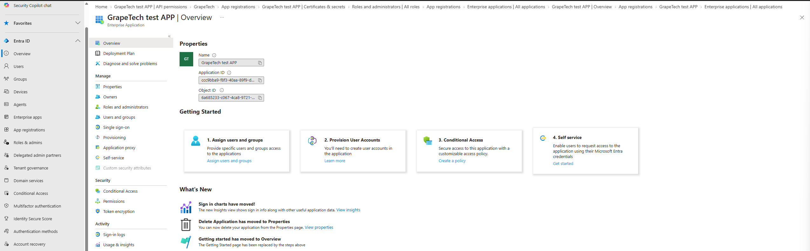

# App Management: Service Principal

## What a Service Principal actually is

Coming out of the App Registration work, it's worth slowing down on this because it's a concept
that's easy to gloss over but really matters for how Entra ID governs applications. The App
Registration is the blueprint of an app - its name, the permissions it's asking for, its redirect
URIs, its credentials. On its own, that blueprint doesn't hold any actual access. What actually
gets granted permissions, gets assigned to users and groups, gets targeted by Conditional Access
policies, and shows up in sign-in logs is a separate object: the Service Principal. Think of the
App Registration as the app's identity card design, and the Service Principal as the actual card
issued and valid within one specific tenant - the design can be reused, but each issued card is a
distinct, local object.

### How a Service Principal gets created

For a single-tenant app like the one I registered - "Accounts in this organizational directory
only" - both objects are created together, automatically, the moment you finish the New
registration wizard. Entra doesn't ask you to separately create the Service Principal; it just
does it, and that's exactly why "GrapeTech test APP" already showed up under Enterprise
applications without me doing anything extra there.

### Multi-tenant apps and replication into other tenants

This is where it gets more interesting, and where the distinction between the two objects really
earns its keep. If an app is registered as multi-tenant ("Accounts in any organizational
directory") instead of single-tenant, the App Registration itself still only lives in one place -
the publisher's home tenant, in this case GrapeTech. But the app can be used by other,
completely separate tenants too. The first time a user or admin in one of those other tenants
signs in to the app (or an admin grants consent there), Entra doesn't copy the App Registration
anywhere - instead, it automatically creates a brand new Service Principal object, local to that
foreign tenant, representing that same app. That foreign tenant's admin can then manage their own
copy of the Service Principal completely independently: assign their own users and groups to it,
apply their own Conditional Access policies against it, grant or restrict permissions on their own
side - none of that touches the original App Registration back in GrapeTech's tenant, and none of
it affects any other tenant that might also be using the app. What ties all these separate Service
Principal objects together across every tenant is that they all share the exact same Application
(client) ID, since they all point back to the same underlying app definition - but each one has its
own unique Object ID, because each is a genuinely separate directory object living in its own
tenant. My GrapeTech test APP is single-tenant, so this replication doesn't apply to it in
practice, but the Object ID vs Application ID distinction I confirmed below is the exact same
mechanism that makes multi-tenant replication work.

## In practice:

The point of this check wasn't just to look at two Numbers.The App Registration and the Service Principal really are two distinct, separate
objects in the Entra ID directory, rather than the same underlying record simply displayed in two
different menus of the portal. If they were truly the same thing, they would show the same Object ID. 
Instead, the check found two different Object IDs (one on the App registrations page, one on the Enterprise applications page) while the
Application ID stayed identical on both - proof that Entra ID actually stores two separate records
for this one app, linked to each other only through that one shared identifier.

*GrapeTech test APP, App registrations > Overview: Application (client) ID
ccc9bba9-f8f3-40aa-89f9-d42a3d1974ae, Object ID 179d9510-44a9-4c51-b315-56222a67ab31.*

*GrapeTech test APP, Enterprise applications > Overview/Properties: Application ID
ccc9bba9-f8f3-40aa-89f9-d42a3d1974ae (same as above), Object ID 6a685233-c067-4ca8-9721-...
(different from the App Registration's Object ID).*
