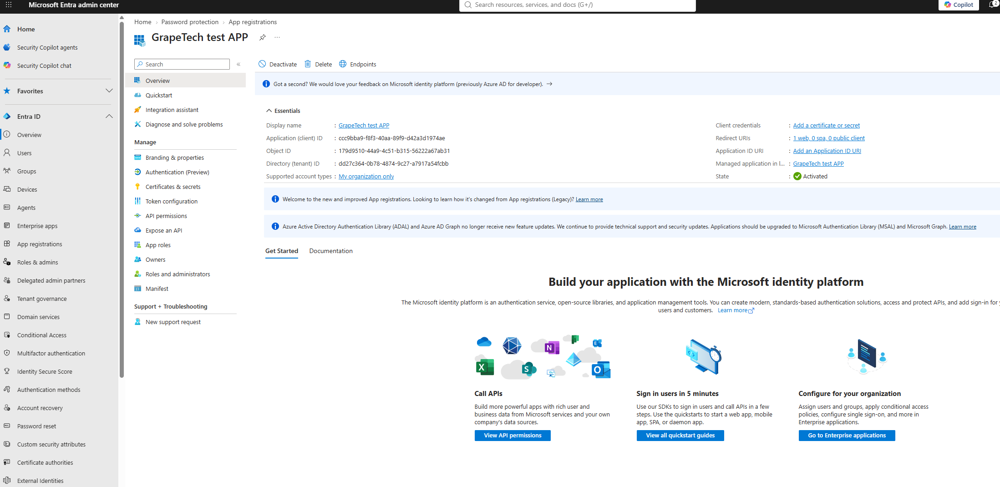
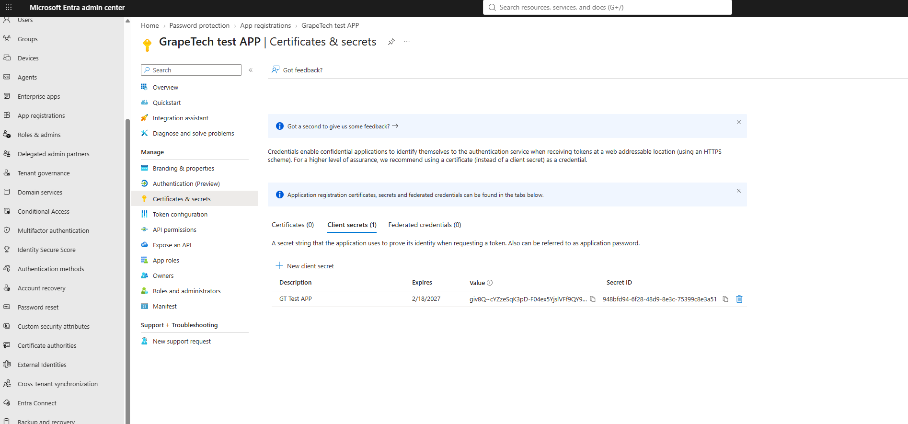
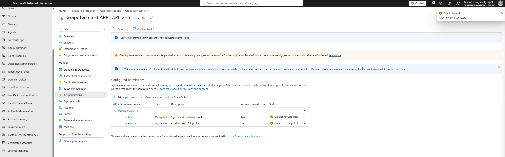
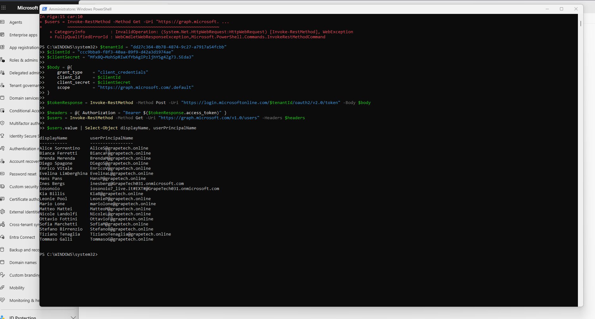

# App Management: App Registration

## Theory - what App Registration is and why it matters

An App Registration in Entra ID is essentially how an application gets its own identity inside the
directory. Up to this point in the project, every identity I've dealt with has belonged to a human
- an employee, an admin, a guest. But modern environments are full of applications, scripts, and
background services that also need to authenticate and call APIs, and Entra ID handles that through
the exact same directory, just with a different kind of object. When you register an app, Entra
actually creates two linked objects behind the scenes: the App Registration itself, which is the
definition of the app (its name, redirect URIs, the permissions it's asking for, its credentials),
and a corresponding Service Principal under Enterprise Applications, which is the actual usable
instance of that app inside this specific tenant. It's a subtle distinction, but an important one
for the exam and for real governance: the registration is the blueprint, the service principal is
the thing that actually holds permissions and gets consented to.

## Delegated permissions vs Application permissions - and why it matters

This is probably the single most important concept in this whole module, so it's worth walking
through carefully rather than just listing it. A Delegated permission means the app is acting on
behalf of a specific person who is actually signed in at that moment. Its access is effectively
capped by whatever that person is themselves allowed to do - so User.Read (Delegated) just lets the
app read the profile of whoever happens to be logged in right now, nothing more, nothing less. An
Application permission is a completely different animal: the app acts as itself, with its own
identity, and there's no user involved at all - this is the Client Credentials flow, where the app
authenticates purely with a Client ID and a secret (or certificate), no human in the loop. Because
there's no user to scope the access down to, Application permissions tend to be much broader by
necessity. User.Read.All (Application) doesn't mean "read the profile of whoever is using the app"
- it means the app can read every single user's full profile in the tenant, at any time, whether or
not anyone is actively using it.

That difference in scope is exactly why Entra treats the two so differently when it comes to
consent. A Delegated permission can often be consented to by the user themselves right at sign-in,
depending on the tenant's consent settings - the user is right there, making an informed choice
about their own access. An Application permission has no such moment, since there's no interactive
sign-in to hang a consent prompt off of, so Microsoft simply won't let the app use it until an
administrator has explicitly clicked "Grant admin consent" ahead of time. It's a deliberate
checkpoint: nobody gets silent, tenant-wide access to everyone's data just by registering an app
and asking for it - a human with real authority has to consciously say yes first.

## What I did

### ***DISCLAIMER***: it wouldn't be possible to achieve this resoult without the help of AI.

I started by creating the app itself: Entra admin center > App registrations > New registration,
named it "GrapeTech test APP", picked "Accounts in this organizational directory only" since this
is a single-tenant test app with no need to support external organizations, and set the Redirect
URI to http://localhost, which is fine for local testing. Once it was created, the Overview page
gave me the two identifiers I'd need for everything else: the Application (client) ID
(ccc9bba9-f8f3-40aa-89f9-d42a3d1974ae) and the Directory (tenant) ID
(dd27c364-0b78-4874-9c27-a7917a54fcbb).

*GrapeTech test APP Overview: Application (client) ID, Object ID, Directory (tenant) ID, Client
credentials, Redirect URIs, Supported account types "My organization only", State Activated.*

#### ***Next came the client secret, and this is where I actually tripped up twice, which ended up being a
good lesson in itself. The first time, I created a new client secret under Certificates & secrets
and then navigated away from the page before copying the Value - and it turns out Entra only shows
that Value once, right at creation. Once you leave the page, it's masked forever, even for an admin,
even if you go looking for it later.*** On top of that, I initially grabbed the wrong thing anyway: the
Secret ID (a GUID that just identifies the secret record) instead of the Value (the actual secret
string used to authenticate) - they sit right next to each other in the same row and are very easy
to confuse if you don't know to look for the difference. I ended up creating a second client secret
("GT Test APP", expiring 2/18/2027) and this time copied the Value immediately, before doing
anything else on the page.

*Certificates & secrets, Client secrets (1): description "GT Test APP", Expires 2/18/2027, Value
column showing the secret (masked after this point), Secret ID column separately visible - the two
values that are easy to mix up.*

With the app and secret sorted, I moved on to permissions, and made a point of adding one of each
kind so I could actually see the Delegated vs Application distinction in practice rather than just
reading about it. Under API permissions > Add a permission > Microsoft Graph, User.Read (Delegated)
was already there by default - "Sign in and read user profile". I then switched to the Application
permissions tab and searched for User.Read.All - "Read all users' full profiles" - and added it.
As expected, it showed up with "Admin consent required: Yes", so I clicked Grant admin consent for
GrapeTech and confirmed. Both permissions ended up listed with a green check and Status "Granted for
GrapeTech", and a "Grant consent successful" notification confirmed it went through.

*API permissions final state: User.Read (Delegated) and User.Read.All (Application) both showing
Status "Granted for GrapeTech" with a green check; "Grant consent successful" notification visible
top right.*

The last part was proving all of this actually works, not just that the portal says it's configured
correctly. I don't have Postman installed and didn't want to add another tool just for one test, so
I used PowerShell's built-in Invoke-RestMethod instead, which meant I could run everything from a
terminal I already had. The script does two things: it POSTs to the tenant's token endpoint
(https://login.microsoftonline.com/<tenantId>/oauth2/v2.0/token) with grant_type=client_credentials
plus the Client ID, Client Secret, and scope=https://graph.microsoft.com/.default to get an access
token, and then uses that token as a Bearer header to call GET
https://graph.microsoft.com/v1.0/users. My first couple of attempts failed with a WebException -
partly because I'd left the angle brackets (< >) around the placeholder values instead of replacing
them entirely, and partly because I was still using the wrong secret from the earlier mix-up. Once
I fixed both, the script ran cleanly and printed a full table of displayName and userPrincipalName
for all 20 users in the tenant. That result is the real proof of everything in this module coming
together: the app authenticated purely as itself, with the Client ID and secret, using the
Application permission I set up, and with zero user ever signed in during the whole process.

*Windows PowerShell running the Client Credentials script: token request, Graph API call to
/v1.0/users, and the resulting table of all 20 tenant users (displayName, userPrincipalName) -
confirmation the app-only authentication flow works end-to-end.*
