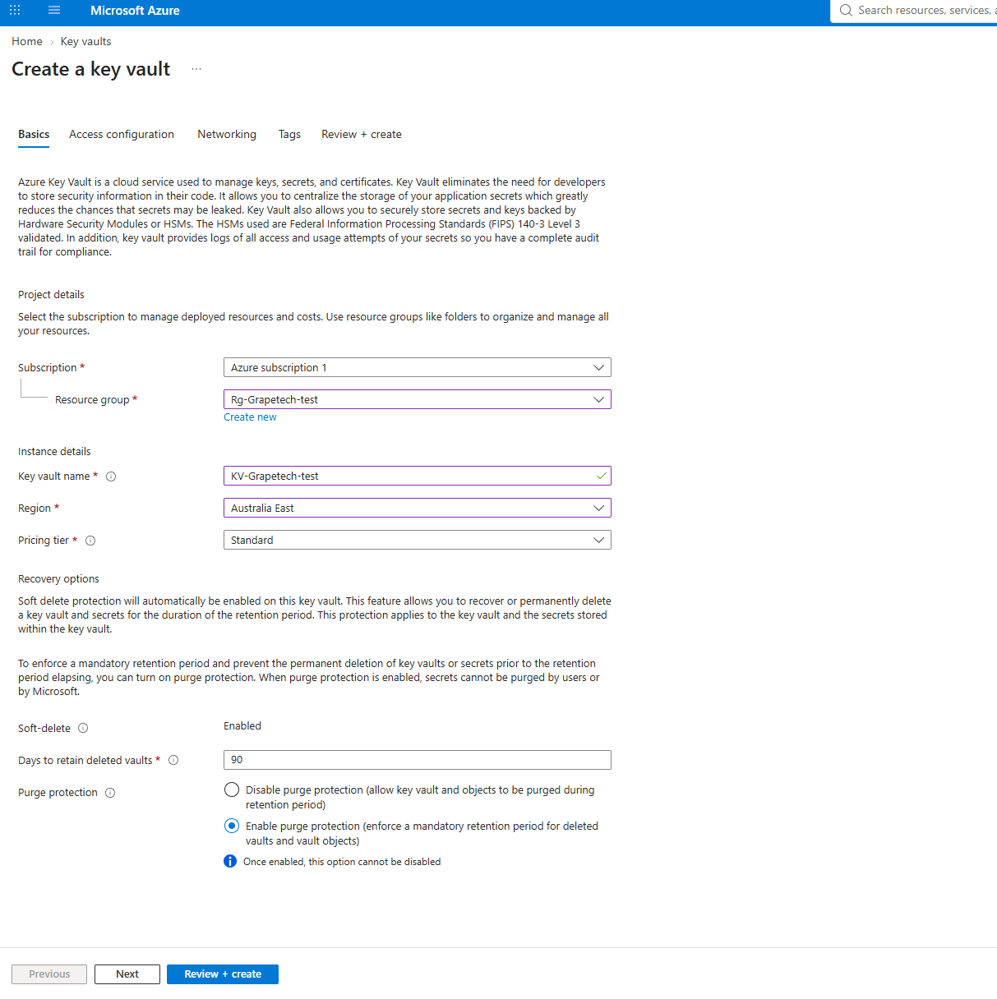
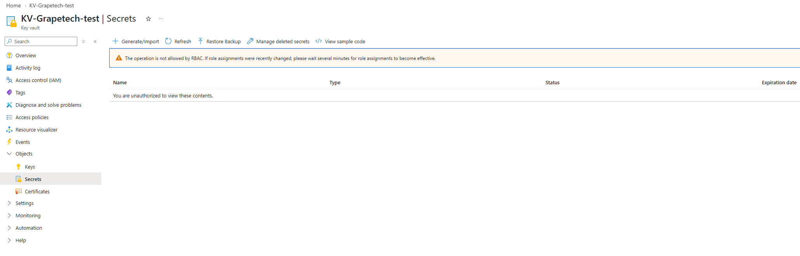
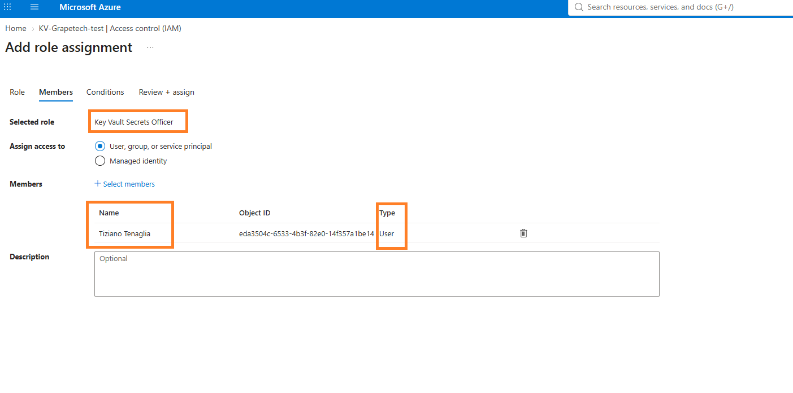
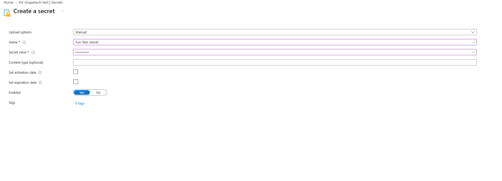
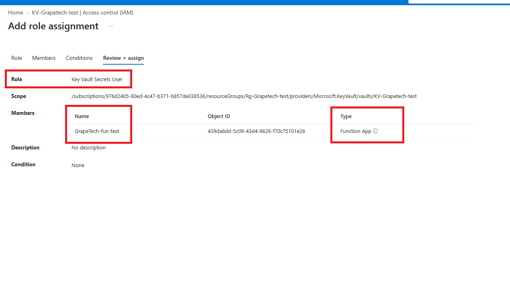

# App Management: Azure Key Vault

## What Azure Key Vault is

Azure Key Vault is a centralized, encrypted storage service for the three types of sensitive
material an application typically needs but should never hardcode into its own code or
configuration: secrets (arbitrary strings - API keys, passwords, connection strings), encryption
keys (cryptographic keys used for encrypt/decrypt/sign operations, optionally backed by Hardware
Security Modules), and certificates (X.509 certificates with their private keys, including
lifecycle/renewal support). 

## Control plane vs Data plane

This distinction is fundamental to how Key Vault is actually governed, and it's easy to overlook.
The control plane is about the vault as an Azure resource itself - creating it, deleting it,
configuring its properties, choosing its access model. This is managed through Azure Resource
Manager and governed by regular Azure RBAC at the subscription/resource group level, same as any
other Azure resource. The data plane is a separate layer entirely - it's about what happens to the
actual contents inside the vault: reading a secret, listing keys, adding a certificate. Having
permission on the control plane (being able to create or delete the vault) does not automatically
grant permission on the data plane (being able to read what's inside it) - and this separation is
exactly what caused the "unauthorized" error I ran into (screenshoot aviable in the "what i did" section below).

## Data plane access models: Access Policies vs Azure RBAC

The data plane itself can be governed in one of two ways. Access Policies is the older, classic
model: a list of principals attached directly to the vault object, each with a set of granular
permissions per object type (Get, List, Set, Delete for secrets/keys/certs individually) - simple,
but it lives outside the normal Azure RBAC system, so it doesn't benefit from centralized IAM
auditing or things like PIM eligibility in the same way everything else in this project has.
Azure RBAC is the modern, recommended model, and the one I used for this vault: access is granted
through standard Azure role assignments, the exact same mechanism used everywhere else in Azure,
which means it's consistent, centrally auditable, and can be scoped just as precisely.

## Connecting an identity to Key Vault for seamless authentication

Both a Service Principal (an App Registration with a client secret or certificate) and a Managed
Identity can be granted access to Key Vault through an RBAC role assignment, letting an application
authenticate to the vault without a human ever being involved. Managed Identity is the stronger
option of the two specifically because there's no credential to create, store, rotate, or leak in
the first place - Entra handles that behind the scenes - which is exactly why it's the pairing this
project ended up using for the Function App.

## Soft delete and Purge protection

Soft delete means that deleting the vault, or an individual object inside it, doesn't make it
disappear immediately - it moves into a recoverable state for a retention period (90 days by
default) and can be restored during that window instead of being gone for good the moment someone
clicks Delete. Purge protection is an extra layer on top of that: it prevents anyone - including the
subscription Owner, and even Microsoft - from permanently purging a soft-deleted vault or object
before that retention period actually runs out. Once turned on, it can never be turned back off,
which is exactly why I chose to leave it disabled on this test vault: I wanted the ability to fully
and immediately tear it down at the end of the project without a mandatory 90-day limbo, even though
in a production environment purge protection is generally the safer default.

*Create a key vault, Basics tab: Resource group Rg-Grapetech-test, Key vault name KV-Grapetech-test,
Region Australia East, Pricing tier Standard, Soft-delete Enabled (90 days), Purge protection shown
with "Enable purge protection" selected for illustration of what the option does - the vault that
was actually deployed was created with purge protection disabled, to allow a full, immediate
teardown at the end of the project.*

## Roles, briefly

-***Key Vault Administrator***: full data-plane control over everything in the vault - secrets, keys,
  certificates, and access management itself.

-***Key Vault Secrets Officer***: full management of secrets specifically (create, read, update, delete)
  but no access to keys or certificates.

-***Key Vault Secrets User***: read-only access to secrets (get/list only) - the least-privilege role for
  something that just needs to consume a secret, nothing more.

-***Contributor***: a control-plane role, not a Key Vault-specific one - it can manage the vault resource
  itself, but under the RBAC model it grants no data-plane access to what's actually inside it,
  which is the same control/data plane separation from earlier showing up again here.

## What I did

Created the Key Vault (KV-Grapetech-test) in the same resource group as the Function App. Right
after creating it, I tried to add a test secret and immediately hit "You are unauthorized to view
these contents" - "The operation is not allowed by RBAC." Even as the tenant's Global Administrator,
I had zero data-plane access to my own vault by default, which is the control plane/data plane
separation from above playing out directly: creating the vault (control plane) doesn't grant any
rights over its contents (data plane). I fixed this by going to Access control (IAM) and assigning
myself the Key Vault Secrets Officer role, waited a couple of minutes for the role assignment to
propagate, and was then able to successfully create the secret ("Fun-Test-Secret").

*Add role assignment, fix for the unauthorized error above, granting myself just enough data-plane access to manage secrets.*

*Create a secret form: Name "Fun-Test-Secret", Secret value entered (masked), Enabled = Yes.*

With that working, the last step was giving the Function App's Managed Identity its own access -
scoped down properly this time. Rather than giving it Secrets Officer (which I'd needed for myself
to manage the secret), I assigned it ***Key Vault Secrets User*** instead, since all it actually needs to
do is read the secret's value at runtime, never create or modify anything. That's the whole chain
closed end to end: the Function App authenticates as itself via its Managed Identity, with no
credential anywhere in its code or configuration, and can read exactly the one thing it's allowed to
read - nothing more.

*Add role assignment, Review + assign: Role Key Vault Secrets User, Scope KV-Grapetech-test,
Member GrapeTech-fun-test (Function App), Object ID 439da8dd-5c09-43d4-8626-f70c75101e26.*
