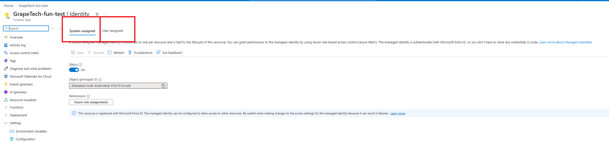
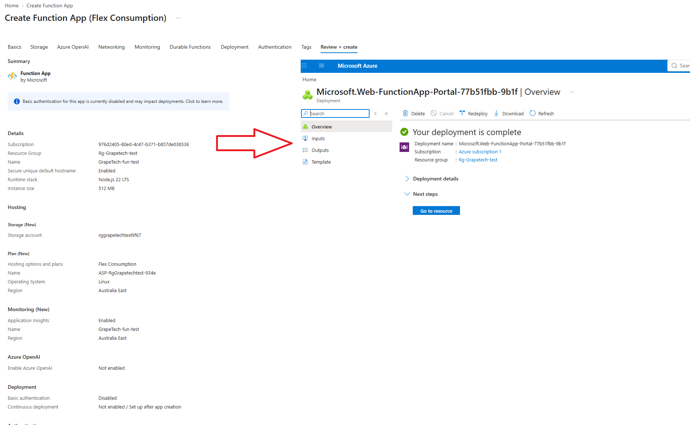

# Azure Resources (Function App) and Managed Identity

### ***Why Azure Functions on the Consumption plan*** 

For this project I deliberately avoided spinning up a VM before absolutely necessary, keeping that
for later, and Managed Identity still needs some kind of Azure resource to live on. Azure Functions
on the Flex Consumption plan solved that: it scales to zero when nothing is running, so there's no
compute cost sitting idle, and it comes with a permanent free monthly grant rather than a
time-limited trial - the cheapest and simplest way to have a real Azure resource to attach an
identity to.

## What a Managed Identity actually is

A Managed Identity is an identity for an Azure resource that Entra ID creates and manages
automatically on your behalf. The whole point of it is that it eliminates the need to store any
credentials at all - no client secret, no certificate, nothing sitting in a config file or in code
that could be copied, leaked, or forgotten about (exactly the kind of problem I ran into earlier
with the App Registration's client secret)[check the mistake@](App%tripped-twiceregistration.md#tripped-twice). Entra ID handles the authentication behind the scenes,
so the resource can just ask for a token and use it, with nothing for me as the admin to create,
rotate, or protect.

## System-assigned vs User-assigned

There are two flavors, and the difference comes down to lifecycle and reusability. A
System-assigned managed identity is created directly tied to one specific resource - when I turn it
on for the Function App, it exists because the Function App exists, and if I ever delete the
Function App, the identity is deleted right along with it. It only ever attaches to that single
resource. A User-assigned managed identity works differently: it's created as its own standalone
object, independent of any particular resource, which means it's permanent in the sense that it
isn't tied to any one resource's lifecycle - it can be reused and attached to multiple different
Azure resources at the same time, all sharing that one identity and whatever permissions have been
granted to it. For this project, with just the one Function App and no plan to share the identity
elsewhere, System-assigned was the simpler and more appropriate choice.

## What I did

Created the Function App (GrapeTech-fun-test) on the Flex Consumption plan, in the Rg-Grapetech-test
resource group, Australia East region - deployment completed successfully. Then went to the
Function App's Identity blade, System assigned tab, and switched Status from Off to On, saved, and
confirmed. Entra generated an Object (principal) ID for it this is the same identity that was later granted the Key
Vault Secrets User role, letting the Function App read the test secret with zero
stored credentials anywhere.

*Create Function App (Flex Consumption), Review + create, deployment overview:
"Your deployment is complete" for GrapeTech-fun-test, Resource group Rg-Grapetech-test.*

