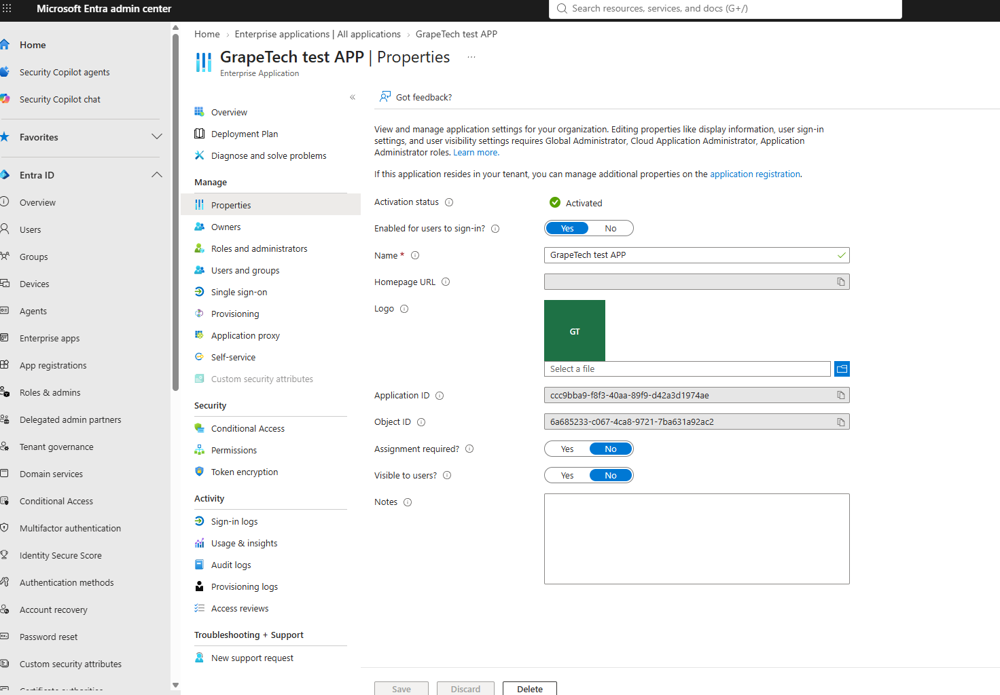
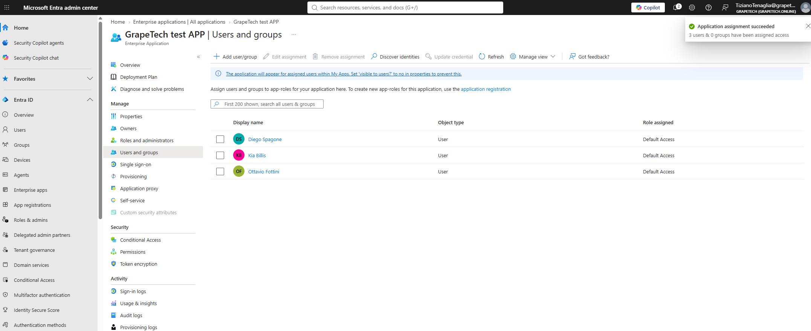
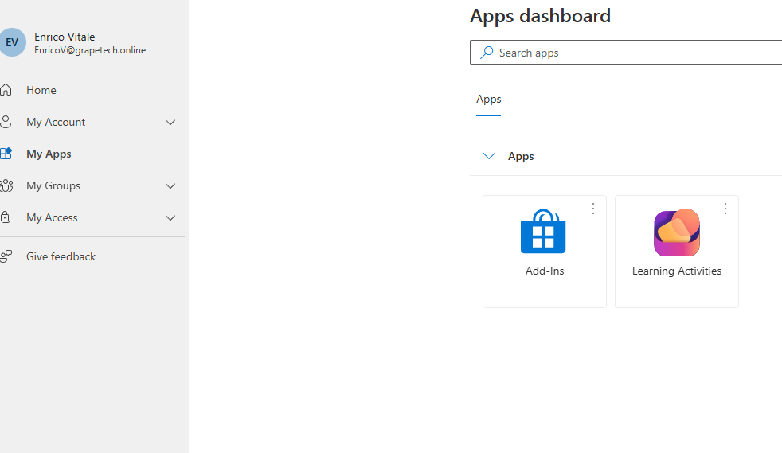
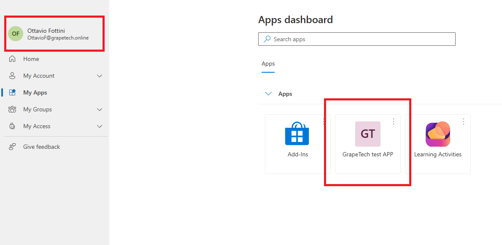

# Enterprise Applications

## What an Enterprise Application actually is

This is the same object I confirmed empirically back in Module 6.2: the Service Principal that gets
created alongside every App Registration. App Registration defines what the app is - its name, its
permissions, its credentials. Enterprise Application is the page in the portal built around managing
how that app behaves and is governed inside this specific tenant - who can sign in to it, how it
authenticates, whether it syncs users with an external system.

### Single sign-on, Provisioning, and API permissions

The Enterprise Application blade groups a few distinct capabilities together:

- Single sign-on (SSO) configures how users authenticate into the app without re-entering separate
  credentials. For a classic SAML or WS-Fed enterprise app (Salesforce, ServiceNow, and similar),
  this is where you'd set up SAML metadata, signing certificates, and claim mappings. For an app like
  mine, registered natively in Entra ID and using OAuth2/OIDC, this section is largely a formality -
  SSO is already inherent to the OAuth sign-in flow itself.
- Provisioning automates creating, updating, and disabling user accounts inside the target
  application's own directory whenever something changes in Entra ID - for example, a new hire
  automatically getting an account created in a connected SaaS tool. It's the bridge between Entra ID
  as the source of truth and an app's separate internal user store.
- API permissions here mirrors what's already visible on the App Registration side (Module 7.1) -
  the Delegated and Application permissions requested and consented to. It shows up on both objects
  because it's actually the Service Principal, not the App Registration, that holds the granted
  consent in the directory.

Assignment required, Enabled for sign-in, and Visible to users

Before assigning anyone to the app, three settings on the Properties page determine whether that
assignment actually matters:

***- Enabled for users to sign-in?***: the *master switch* for the app. If set to No, nobody can sign in to
  it at all, regardless of any other setting.
***- Assignment required?***: this is the one that makes user/group assignment meaningful. If set to No,
  anyone in the tenant can sign in to the app without being explicitly assigned or and if app is not visible, user can still sign in using the app URL - assigning specific
  users at that point would be a no-op, since access isn't actually gated by it. Setting this to Yes
  is what turns "Users and groups" into a real access control list rather than just a display list.
***- Visible to users?***: controls whether the app shows up as a tile in the assigned users' My Apps
  portal. It's a convenience/discoverability setting, not a security boundary - even set to No, an
  assigned user could still reach the app directly if they had its URL.

I set both Assignment required and Visible to users to Yes, so that assignment would have a real
effect and the app would also be discoverable by the users I assigned.

## What I did

Went to Enterprise applications > GrapeTech test APP > Properties, switched Assignment required? to
Yes and Visible to users? to Yes, and saved. Then moved to Users and groups > Add user/group and
assigned three existing tenant users - Diego Spagone, Kia Billis, and Ottavio Fottini - to the app.
Since this app has no custom app roles defined (no roles were created back in App Registration), all
three were automatically assigned the built-in Default Access role, which is the generic fallback
role Entra ID uses whenever an app doesn't define its own. The portal confirmed with "Application
assignment succeeded - 3 users & 0 groups have been assigned access."

*GrapeTech test APP | Properties: Enabled for users to sign-in = Yes, Assignment required? = Yes,
Visible to users? = Yes, alongside the app's Application ID and Object ID.*

*GrapeTech test APP | Users and groups: Diego Spagone, Kia Billis, and Ottavio Fottini listed as
Users with Role assigned = Default Access; notification banner "Application assignment succeeded -
3 users & 0 groups have been assigned access."*

## Proving it with two real logins

Explaining Assignment required and Visible to users in theory is one thing, but I wanted to actually
see the difference from the end user's side, not just trust the portal's description. I signed in to
myapps.microsoft.com as two different tenant users. First as Enrico Vitale, who was never assigned to
this app: his My Apps dashboard showed only the tenant's default apps,no GrapeTech test APP tile anywhere, confirming that an unassigned user simply doesn't see it. 

*myapps.microsoft.com signed in as Enrico Vitale (not assigned): Apps dashboard shows only Add-Ins
and Learning Activities - no GrapeTech test APP tile.*

Then I
signed in as Ottavio Fottini, one of the three users I assigned earlier: his My Apps dashboard showed
that same default set of apps plus a GrapeTech test APP tile, right there alongside them. Same tenant,
same app, two different outcomes purely based on whether the user is in the assignment list - which is
exactly what Assignment required and Visible to users are supposed to produce, now confirmed by
actually looking at it from two separate accounts instead of taking the setting's description at face
value.

*myapps.microsoft.com signed in as Ottavio Fottini (assigned): Apps dashboard shows Add-Ins,
GrapeTech test APP, and Learning Activities - the app tile is now visible.*
