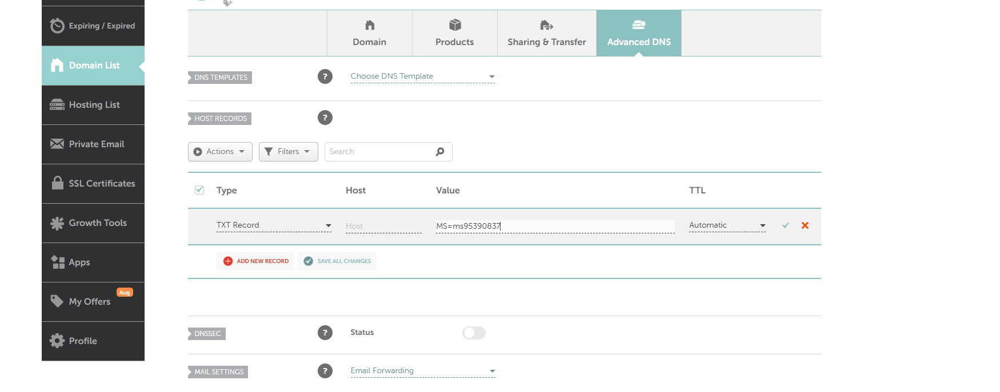

# Module 1.0 – Custom domain registration & verification

## What I did

Registered the domain grapetech.online through Namecheap and added it as a custom domain name in Microsoft Entra ID, 
replacing the default .onmicrosoft.com domain for the GrapeTech tenant. 

## Steps

1. I Purchased grapetech.online via Namecheap.
2. In Microsoft Entra admin center → Identity → Settings → Domain names, added grapetech.online 
   as a custom domain.
3. Entra generated a TXT record to prove domain ownership:
   - Host: `@`
   - Value: `MS=ms95390837`
4. Added this TXT record in Namecheap's Advanced DNS settings (Host Records section).
5. Returned to Entra admin center and clicked **Verify** — after DNS propagation, the domain was 
   successfully verified.

## Why this matters

A verified custom domain allows creating tenant users with a professional identity 
(e.g. `user@grapetech.online`) instead of the default `.onmicrosoft.com` suffix.

## Screenshots

*Custom domain grapetech.online added to the Entra tenant, showing the required TXT record.*

*TXT record created in Namecheap's Advanced DNS panel matching Entra's requirements.*

*Confirmation notification: domain verification succeeded.*